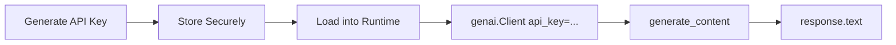

# Gemini API Key Setup

## Why an API Key Is Required

Programmatic access to Gemini models requires authentication via an **API key**. Without it, SDK calls fail with:

```
ValueError: No API key was provided. Please pass a valid API key.
```

The key identifies your project and enables usage tracking and billing.

---

## Step 1: Generate the API Key

1. Open [Google AI Studio](https://aistudio.google.com)
2. Click **Get API key** (bottom-left)
3. Select or create a **GCP project**
4. Click **Create API key** → select **Gemini API**
5. Copy the key immediately (store securely)

### Key Management

| Action | Purpose |
|--------|---------|
| View usage | Monitor API requests and costs per key |
| Copy key | Use in applications |
| Revoke/regenerate | Rotate compromised keys |

---

## Step 2: Secure Storage

**Never hardcode API keys in source code** committed to version control.

### Option A: Environment Variables (Production)

```bash
# .env file (add to .gitignore)
GEMINI_API_KEY=your_key_here
```

```python
import os
from dotenv import load_dotenv

load_dotenv()
api_key = os.getenv("GEMINI_API_KEY")
```

### Option B: Colab Secrets (Notebooks)

```python
from google.colab import userdata
gemini_api_key = userdata.get("GEMINI_API_KEY")
```

Store the key in Colab's Secrets panel (key icon) with name `GEMINI_API_KEY`.

---

## Step 3: Initialise the Client

```python
from google import genai

client = genai.Client(api_key=gemini_api_key)

response = client.models.generate_content(
    model="gemini-2.5-flash",
    contents="Explain how AI works in a few words"
)
print(response.text)
# "AI learns patterns from data to make predictions."
```

**Critical:** passing the key to `genai.Client(api_key=...)` is required — importing the library alone is insufficient.



---

## Security Best Practices

- Add `.env` to `.gitignore` — never commit secrets
- Use separate keys per environment (dev/staging/prod)
- Monitor usage to detect unexpected spend
- Rotate keys if exposed
- Use Colab secrets or cloud secret managers, not plaintext in notebooks shared publicly

---

## Common Pitfalls / Exam Traps

- **Hardcoding API keys in notebooks shared on GitHub** — immediate security breach.
- **Forgetting to pass api_key to Client()** — most common integration error.
- **Confusing API key with OAuth credentials** — Gemini AI Studio uses simple API keys, not full OAuth for basic usage.
- **Not adding .env to .gitignore** — secrets get committed accidentally.
- **Using the same key across all environments** — prevents independent revocation and cost tracking.

---

## Quick Revision Summary

- Gemini SDK requires an API key for all programmatic calls.
- Generate keys in Google AI Studio → Get API key → Create.
- Store keys in `.env` (production) or Colab Secrets (notebooks).
- Initialise: `genai.Client(api_key=your_key)`.
- Never commit API keys to version control.
- Monitor usage and costs via the AI Studio dashboard.
