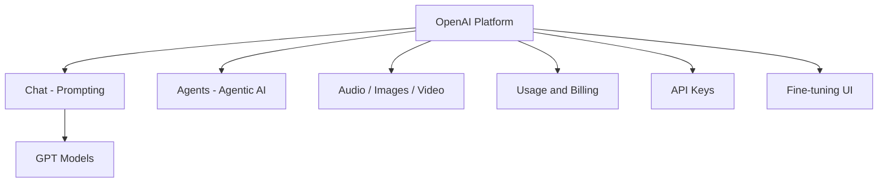

# OpenAI Platform and API Setup

## OpenAI Platform Overview

The OpenAI Platform (`platform.openai.com`) provides chat interfaces, agent builders, media generation tools, API management, and fine-tuning — all accessible from a single dashboard.



---

## Dashboard Essentials

| Section | Purpose |
|---------|---------|
| **Chat** | Interactive prompt testing with model selection |
| **Agents** | Build agentic AI workflows via UI |
| **Audio / Images / Video** | Multimodal generation tools |
| **Usage** | Track API consumption and costs |
| **API Keys** | Create and manage secret keys |
| **Fine-tuning** | Fine-tune base models without scripting |
| **Logs / Storage** | Data management for applications |

**Billing tip:** Add a small credit balance ($5–$10) and monitor usage — overspending is easy with pay-per-token pricing.

---

## Chat Playground Settings

| Parameter | Purpose | Recommended |
|-----------|---------|-------------|
| **Model** | GPT variant selection | Match task to model tier |
| **System message** | Persistent instructions (tone, format) | Set role and constraints |
| **User prompt** | Per-request task input | Your actual query |
| **Temperature** | Creativity (0–2) | 0–1 for most tasks |
| **Max tokens** | Response length cap | Limits cost per request |
| **Top-P** | Nucleus sampling | ~0.9 for balanced output |
| **Tools** | Function calling attachments | Optional per use case |
| **Variables** | Reusable template variables | e.g., `city = Mumbai` |

---

## API Key Generation

1. Navigate to **API Keys** in the left sidebar
2. Click **Create new secret key**
3. Select project, name the key (e.g., "demo")
4. **Copy immediately** — the key is shown only once
5. Store securely (`.env` or Colab Secrets)

---

## Python SDK Integration

```python
from openai import OpenAI
import os

client = OpenAI(api_key=os.getenv("OPENAI_API_KEY"))

response = client.responses.create(
    model="gpt-4.1",
    input="Write a one-sentence bedtime story about a unicorn"
)
print(response.output_text)
```

Error without key:
```
OpenAIError: The api_key client option must be set either by passing
api_key or by setting the OPENAI_API_KEY environment variable.
```

### Colab Secrets Setup

```python
from google.colab import userdata
openai_api_key = userdata.get("OPENAI_API_KEY")
```

Pass to `OpenAI(api_key=openai_api_key)`.

---

## OpenAI vs Google AI Studio

| Aspect | OpenAI Platform | Google AI Studio |
|--------|-----------------|------------------|
| Models | GPT family | Gemini family |
| Key storage | `OPENAI_API_KEY` env var | `GEMINI_API_KEY` env var |
| SDK | `openai` package | `google.genai` package |
| Playground | Chat with system/user messages | Playground with system instructions |
| Fine-tuning UI | Yes | Limited |

---

## Documentation

Full API reference: `developers.openai.com/api/docs`

Includes model pricing, endpoint specifications, and copy-paste code for Python and JavaScript.

---

## Common Pitfalls / Exam Traps

- **Not saving the API key at creation** — it cannot be retrieved later; only regenerated.
- **Committing keys to GitHub** — use `.env` + `.gitignore`.
- **Ignoring max_tokens** — uncapped responses inflate API costs.
- **Confusing ChatGPT (consumer app) with OpenAI API** — different products, different billing.
- **Forgetting to set api_key in client constructor** — same error pattern as Gemini integration.

---

## Quick Revision Summary

- OpenAI Platform: chat testing, agents, API keys, fine-tuning, usage monitoring.
- Playground settings: model, system message, temperature, max tokens, top-P.
- API keys shown once at creation — copy and store immediately.
- Python: `OpenAI(api_key=...)` then `client.responses.create(...)`.
- Set `OPENAI_API_KEY` environment variable or use Colab Secrets.
- Monitor credit balance to avoid unexpected charges.
- Documentation at developers.openai.com/api/docs.
