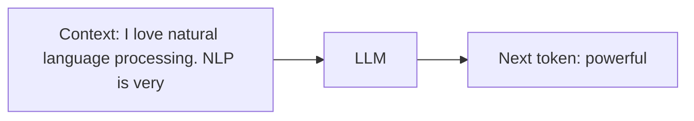

# What Is a Large Language Model (LLM)?

## Defining "Large"

A model earns the label **Large Language Model** based on three scaling dimensions — not a fixed numerical threshold. "Large" is relative and evolves as hardware and research advance.

| Dimension | What Scales | Typical Scale |
|-----------|-------------|---------------|
| **Parameters** | Model weights | Millions to billions ($10^9$+) |
| **Training data** | Text corpus size | Internet-scale: Wikipedia, Stack Overflow, Reddit, books, web crawl |
| **Sequence length** | Context window for next-token prediction | Thousands of tokens (modern models: 128K+) |

What matters is that **scaling produces emergent capabilities** — behaviours not present in smaller models, such as multi-step reasoning, code generation, and instruction following.

---

## The Pre-Training Objective

LLMs are pre-trained with one deceptively simple objective:

> Given a sequence of tokens (context), predict the next token.

### Examples

| Context | Possible Next Tokens |
|---------|---------------------|
| *"I love natural language processing. NLP is very"* | powerful, interesting, useful, ... |
| *"The cat sat on the"* | mat, table, floor, desk, ... |

The chosen token depends on **training data statistics** and **context**. The model learns grammar, factual associations, writing style, and discourse structure — all implicitly, without task-specific labels.

---

## No Labels Required

Pre-training is **self-supervised**: the training signal comes from the text itself (predict the next word). No human annotation of "correct answers" is needed. This is why LLMs can be trained on trillions of tokens from the open web.

After pre-training, models may undergo **fine-tuning** or **RLHF** for instruction following — but the foundation is always next-token prediction at scale.

---

## Emergent Capabilities

As parameters, data, and compute increase, LLMs exhibit capabilities that smaller models lack:

- Multi-paragraph coherent writing
- Code generation and debugging
- Translation and summarisation without task-specific training
- Following complex natural-language instructions (with alignment tuning)

These emerge from scale — they are not explicitly programmed.

---

## Common Pitfalls / Exam Traps

- **Citing a fixed parameter count as the LLM threshold** — there is no strict cutoff; "large" is relative across eras.
- **Confusing pre-training with fine-tuning** — pre-training uses next-token prediction on raw text; fine-tuning uses labelled or preference data.
- **Assuming LLMs need labelled data for pre-training** — pre-training is self-supervised.
- **Treating next-token prediction as trivial** — its simplicity is precisely why it scales; the complexity emerges from data and parameters.

---

## Quick Revision Summary

- LLMs are defined by scale: parameters, training data, and sequence length.
- No strict quantitative threshold — "large" is relative.
- Pre-training objective: given context, predict the next token.
- Pre-training is self-supervised — no task labels required.
- Scaling leads to emergent NLG capabilities.
- Training data (Wikipedia, web, code) determines factual associations and style.
