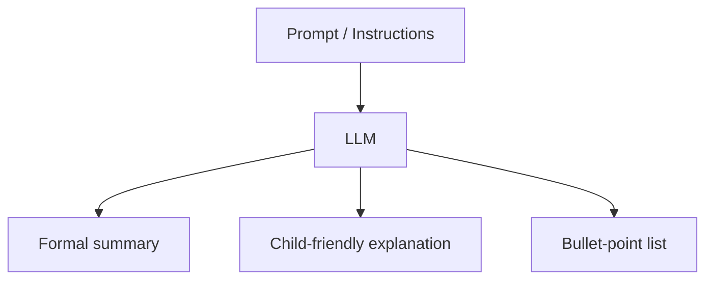

# Why LLMs Excel at Natural Language Generation

## The NLG Leap

Before transformer-based LLMs, generating multi-paragraph coherent text was difficult. RNNs and LSTMs degraded over long sequences. LLMs changed this through scale, attention, and a training objective aligned with generation.

---

## Three Key Strengths

### 1. Long-Range Dependencies

RNNs suffer from vanishing gradients — after several sentences, early context is effectively forgotten. Transformer self-attention lets every token attend to every other token, preserving context across hundreds or thousands of tokens.

**Example:** In a 10-paragraph essay prompt, an LLM can maintain thematic consistency from paragraph 1 to paragraph 10.

### 2. Coherent Multi-Sentence Output

LLMs generate essays, explanations, and multi-paragraph responses that maintain logical flow — a capability largely absent in pre-transformer NLG systems.

### 3. Instruction Adaptation via Prompts

The same model produces different outputs depending on the **prompt** (input instructions). Change the prompt from "summarise this" to "explain this to a 10-year-old" and the output style, depth, and vocabulary shift accordingly.

---

## The Critical Reality Check

LLMs appear intelligent and reasoning-capable, but they are fundamentally **next-token prediction engines**.

| What It Seems Like | What Actually Happens |
|------------------|----------------------|
| Reasoning and thinking | Statistical pattern matching over training data |
| Understanding the question | Conditioning on token sequences |
| Choosing the "right" answer | Selecting the highest-probability next token |

### Example: "The cat sat on the ___"

The model might output *mat*, but *table*, *floor*, and *desk* were also candidates. *Mat* wins because its conditional probability $P(\text{mat} \mid \text{context})$ was highest — not because the model "understood" furniture semantics.

---

## Prompt Quality Determines Output Quality

Because generation is probabilistic and prompt-conditioned:

- Vague prompts produce vague outputs
- Specific format instructions produce structured outputs
- The same model can be brilliant or useless depending on prompt design

This directly motivates **prompt engineering** as a core LLM skill.

---

## Common Pitfalls / Exam Traps

- **Attributing genuine reasoning to LLMs** — they predict tokens probabilistically; chain-of-thought is pattern mimicry, not symbolic reasoning.
- **Ignoring prompt impact** — exam questions about output quality should reference prompting, not just model size.
- **Comparing LLMs to retrieval systems** — LLMs generate text; they do not look up verified facts unless augmented with RAG/search.
- **Assuming deterministic output** — sampling strategies (temperature, top-p) introduce variability.

---

## Quick Revision Summary

- LLMs capture long-range dependencies via transformer attention (unlike RNNs).
- They generate coherent multi-sentence and multi-paragraph text.
- Output adapts to prompt instructions without retraining.
- LLMs are next-token prediction engines, not reasoning systems.
- Token selection is probabilistic — highest-probability token wins.
- Output quality depends heavily on prompt design.
