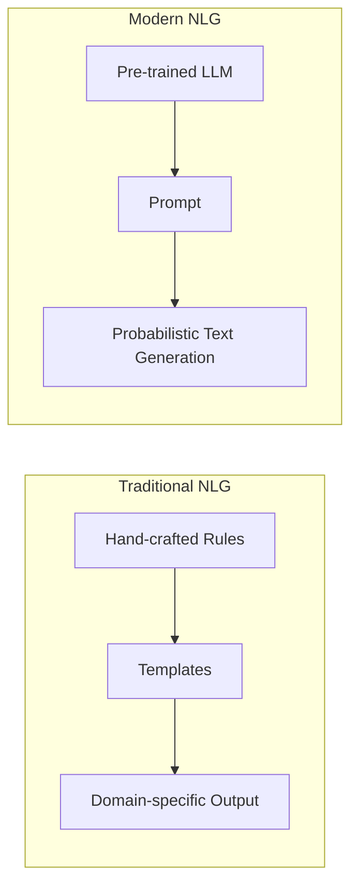

# Natural Language Generation (NLG)

## What Is NLG?

Natural Language Generation (NLG) is the task of producing **human-readable text** from some form of structured or unstructured input. In modern systems, that input is typically a **prompt** — a natural-language instruction that tells the model what to generate.

NLG sits on the output side of the NLP pipeline: where NLU extracts meaning from text, NLG creates text from meaning, data, or instructions.

---

## The Paradigm Shift

### Traditional NLG Systems

- **Rule-based** — explicit if-then logic for sentence construction
- **Template-driven** — fill-in-the-blank patterns (*"Your order {id} will arrive on {date}"*)
- **Highly task-specific** — an e-commerce NLG system could not generalise to healthcare without rebuilding from scratch
- **Brittle** — edge cases and language variation broke rules easily
- **Poor generalisation** — each new domain required new engineering

### LLM-Based NLG

- **Single pre-trained model** serves multiple domains
- **Implicit knowledge** learned from training data — no explicit rules
- **Prompt-driven adaptation** — change the task by changing the prompt, not the code
- **Fluent and coherent** — probabilistic generation produces natural-sounding prose

---

## Comparison Table

| Aspect | Traditional NLG | LLM-Based NLG |
|--------|-----------------|---------------|
| Knowledge source | Explicit rules and templates | Implicit patterns from training data |
| Domain adaptation | Rebuild system per domain | Change the prompt |
| Fluency | Often robotic | Human-like |
| Robustness | Fragile to input variation | More tolerant of varied inputs |
| Generalisation | Poor across tasks | Strong across tasks via prompting |
| Control | Precise but rigid | Flexible but probabilistic |

---

## The Core Shift

> From **explicit rules** to **implicit knowledge** learned from data.

A traditional weather-report generator needed templates for every phrasing variant. An LLM generates varied, natural weather descriptions from a single prompt: *"Write a morning weather briefing for Mumbai in a conversational tone."*

---

## Common NLG Tasks with LLMs

- **Summarisation** — condense long text into a short summary
- **Text expansion** — expand bullet points into full explanations
- **Paraphrasing** — rewrite while preserving meaning
- **Explanation** — generate educational content on any topic
- **Creative writing** — stories, poetry, marketing copy

---

## Common Pitfalls / Exam Traps

- **Treating NLG as deterministic** — LLM output is probabilistic; traditional NLG with fixed templates is deterministic.
- **Claiming LLMs use explicit rules** — they use learned statistical patterns.
- **Ignoring the prompt's role** — in modern NLG, the prompt is the primary control mechanism.
- **Assuming one LLM prompt works for all domains** — prompting must be adapted per task, even with a single model.

---

## Quick Revision Summary

- NLG produces human-readable text from input (typically a prompt).
- Traditional NLG: rule-based, template-driven, domain-specific, brittle.
- LLM-based NLG: single model, prompt-adapted, fluent, generalises across tasks.
- Key shift: explicit rules → implicit knowledge from training data.
- Common tasks: summarisation, expansion, paraphrasing, explanation.
- Modern NLG quality depends on both model capability and prompt design.
