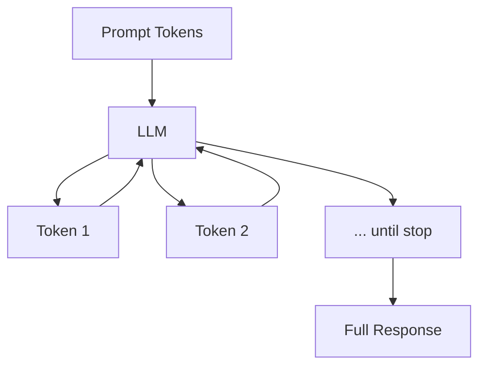

# How LLMs Generate a Response

## Single-Turn vs Multi-Turn Generation

This course focuses on **single-turn** text generation: one prompt, one response, no memory of prior interactions.

| Mode | Behaviour | Example |
|------|-----------|---------|
| **Single-turn** | Each prompt is independent | "Summarise this paragraph" |
| **Multi-turn** | Prior Q&A is retained as context | Q1: "Who is the US president?" → Q2: "What is his age?" (resolves "his") |

### Single-Turn Limitation Demonstrated

```
Prompt 1: "Who is the president of USA?"
Response: "Donald Trump."

Prompt 2: "What is his age?"   (no shared context in single-turn)
Response: "Whose age do you want?" or "Who is he?"
```

In multi-turn mode, the model retains conversation history and correctly resolves pronouns.

**Single-turn use cases:** summarisation, concept explanation, text rewriting, one-shot classification.

---

## What LLMs Actually Do

LLMs do **not**:

- Retrieve answers from a database
- Perform symbolic reasoning
- Verify facts against ground truth

LLMs **only** generate the most probable next token, repeated autoregressively until completion.



---

## Implications for Production Systems

### The Confident Liar Problem

LLM output may sound authoritative but be **factually incorrect**. The model optimises for plausible text, not truth.

- If training data states Bill Clinton was president during the data cutoff, the model may answer "Bill Clinton" even when the real-world answer has changed.
- **Knowledge cutoff date** limits factual accuracy for events after training.

### Probability, Not Truth

Output reflects $P(\text{token} \mid \text{context})$ from training statistics — not verified real-world facts. This is why critical applications need:

- Retrieval-Augmented Generation (RAG)
- Human review
- Grounding with search APIs

---

## Common NLG Tasks

| Task | Description | Example Prompt |
|------|-------------|----------------|
| **Summarisation** | Condense long text | "Summarise this article in 3 sentences" |
| **Text expansion** | Expand brief input | "Expand these bullet points into a paragraph" |
| **Paraphrasing** | Rewrite preserving meaning | "Rephrase this in simpler language" |
| **Explanation** | Teach a concept | "Explain quantum entanglement to a beginner" |

---

## Common Pitfalls / Exam Traps

- **Treating LLM responses as retrieved facts** — they are generated, not looked up.
- **Expecting pronoun resolution in single-turn mode** — no conversation memory exists.
- **Ignoring knowledge cutoff** — models cannot know events after their training data date.
- **Trusting confident tone as accuracy** — fluency does not imply correctness.
- **Confusing single-turn with stateless API calls** — even multi-turn requires explicit history passing in API design.

---

## Quick Revision Summary

- Single-turn: one prompt, one response, no prior context retained.
- Multi-turn: conversation history enables pronoun resolution and follow-ups.
- LLMs generate probable tokens — they do not retrieve or reason symbolically.
- Output may be confident but incorrect (hallucination).
- Factual accuracy is limited by training data and knowledge cutoff.
- Common NLG tasks: summarisation, expansion, paraphrasing, explanation.
- Critical interpretation and better prompting mitigate risks.
