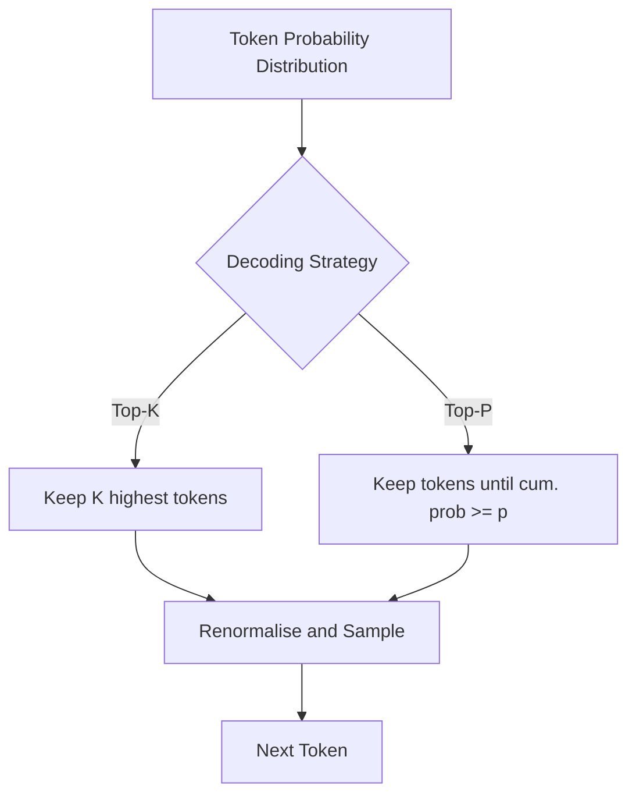

# Controlling LLM Output: Decoding Strategies

## Why the Same Prompt Gives Different Answers

LLMs are largely black boxes — internal weights cannot be directly controlled at inference time. However, **decoding strategies** and **hyperparameters** shape how the model samples from its output probability distribution, giving practitioners control over creativity, determinism, and diversity.

---

## Top-K Sampling

Top-K restricts candidate tokens to the **K most probable** options, renormalises their probabilities, and samples from that subset.

| K Value | Behaviour | Use Case |
|-------|-----------|----------|
| K = 1 | Greedy decoding — always picks highest-probability token | Maximum determinism |
| Small K (e.g., 5) | Focused, conservative output | Factual Q&A, data extraction |
| Large K (e.g., 50) | Diverse, creative, riskier output | Brainstorming, creative writing |

### Example: "The cat sat on the ___"

Candidate tokens: *mat* ($p_1$), *table* ($p_2$), *desk* ($p_3$), *floor* ($p_4$), ...

- **Top-K = 2**: only *mat* and *table* considered (highest two probabilities)
- Sample chosen from this reduced set

Top-K gives **explicit control** over how many alternatives the model considers.

---

## Top-P (Nucleus) Sampling

Top-P selects the **smallest set of tokens** whose cumulative probability exceeds threshold $p$, then samples from that set.

| P Value | Behaviour |
|---------|-----------|
| Low (e.g., 0.7) | Focused, safe generation |
| High (e.g., 0.95) | Diverse, expressive generation |

### Example: Top-P = 0.5

| Token | Probability | Cumulative |
|-------|-------------|------------|
| mat | 0.20 | 0.20 |
| table | 0.15 | 0.35 |
| floor | 0.10 | 0.45 |
| desk | 0.08 | 0.53 (exceeds 0.5 — desk excluded if strict) |

The candidate set **adapts dynamically** — unlike Top-K's fixed count. This flexibility makes Top-P the preferred strategy in industrial NLG systems.

---

## Temperature

Temperature scales the logits before softmax, controlling randomness:

$$P(token_i) = \frac{\exp(z_i / T)}{\sum_j \exp(z_j / T)}$$

| Temperature | Effect | Recommended For |
|-------------|--------|-----------------|
| 0.0 – 0.3 | Deterministic, focused, conservative | Coding, data extraction, factual Q&A |
| 0.4 – 0.7 | Balanced | General-purpose applications |
| 0.7 – 1.0 | Creative, random, diverse | Brainstorming, poetry, creative writing |
| > 1.0 (up to 2.0) | Increasingly nonsensical | Not recommended |

Some APIs allow $T > 1$; beyond 1.0, output becomes incoherent as the model loses control over token selection.

---

## Strategy Comparison

| Parameter | Controls | Fixed vs Adaptive |
|-----------|----------|-------------------|
| Top-K | Number of candidate tokens | Fixed count |
| Top-P | Cumulative probability mass | Adaptive set size |
| Temperature | Sharpness of distribution | Scales all probabilities |

---

## Common Pitfalls / Exam Traps

- **Confusing Top-K and Top-P** — K fixes the count; P fixes the cumulative probability threshold.
- **Using high temperature for factual tasks** — causes hallucination and inconsistency in code/data extraction.
- **Setting temperature > 1 for production** — produces nonsensical output; stay in 0–1 for most applications.
- **Assuming greedy decoding (K=1) is always best** — it maximises local probability but can produce repetitive text.
- **Ignoring that sampling introduces non-determinism** — same prompt can yield different outputs.

---

## Quick Revision Summary

- LLM output variability comes from probabilistic sampling, not random model changes.
- Top-K: sample from the K most probable tokens; K=1 is greedy decoding.
- Top-P (nucleus): sample from smallest set with cumulative probability ≥ p; more flexible than Top-K.
- Temperature (0–1 typical): low = deterministic, high = creative; >1 causes nonsense.
- Use low temperature for coding/Q&A; high temperature for creative writing.
- Top-P with moderate values (e.g., 0.9) is widely used in production.
