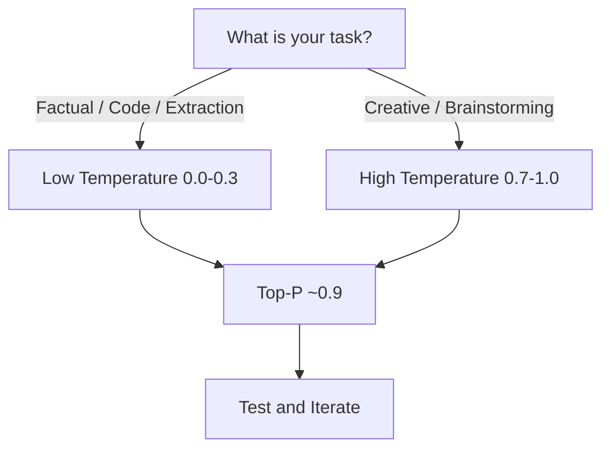

# Choosing the Right Decoding Strategy

## No Universal Best Settings

There is no single optimal decoding configuration for all applications. The right strategy depends on the task, acceptable risk of hallucination, and desired output diversity. The guidelines below provide starting points — always validate on your specific use case.

---

## General Guidelines

| Guideline | Recommendation | Rationale |
|-----------|----------------|-----------|
| Sampling method | **Top-P** over Top-K | Adaptive candidate set; balances control and flexibility |
| Top-P value | **Moderate** (e.g., 0.85–0.95) | Works well as a general default |
| Temperature for factual tasks | **Low** (0.0–0.3) | Minimises randomness in coding, extraction, Q&A |
| Temperature for creative tasks | **High** (0.7–1.0) | Enables diverse brainstorming and writing |

---

## Task-Specific Starting Points

| Application | Temperature | Top-P | Top-K |
|-------------|-------------|-------|-------|
| Code generation | 0.0 – 0.2 | 0.9 | Optional |
| Data extraction / JSON output | 0.0 – 0.1 | 0.8 – 0.9 | — |
| Factual Q&A | 0.1 – 0.3 | 0.9 | — |
| Marketing copy | 0.7 – 0.9 | 0.95 | — |
| Poetry / creative writing | 0.8 – 1.0 | 0.95 | — |
| Quiz generation (structured) | 0.3 – 0.5 | 0.9 | — |

---

## Why Top-P Is Preferred Industrially

Top-K always considers exactly K tokens, even when the probability distribution is sharply peaked (wasting slots on unlikely tokens) or flat (truncating valid options). Top-P adapts:

- **Peaked distribution**: few tokens exceed threshold → conservative output
- **Flat distribution**: many tokens qualify → diverse output

This adaptability makes Top-P the default in Google AI Studio, OpenAI Playground, and most production APIs.

---

## The Experimental Mindset

1. Start with recommended defaults (Top-P ≈ 0.9, temperature matched to task)
2. Generate multiple outputs for the same prompt
3. Evaluate fluency, accuracy, and format compliance
4. Adjust one parameter at a time
5. Document settings per use case in your application config

---

## Common Pitfalls / Exam Traps

- **Claiming one strategy works universally** — settings are application-specific.
- **Using high temperature for JSON/structured output** — causes format violations and hallucinated fields.
- **Choosing Top-K over Top-P without justification** — exams often expect Top-P as the industrial default.
- **Not testing after changing parameters** — small temperature shifts can dramatically alter output quality.
- **Setting both Top-K and Top-P without understanding interaction** — some APIs apply both; know your platform's behaviour.

---

## Quick Revision Summary

- No universally best decoding strategy — tune per application.
- Top-P is generally preferred over Top-K for flexibility.
- Low temperature for informational/factual tasks; high for creative tasks.
- Moderate Top-P (≈0.9) works well as a general starting point.
- Always experiment and iterate — defaults are starting points, not final answers.
- Document hyperparameters per use case in production configs.
