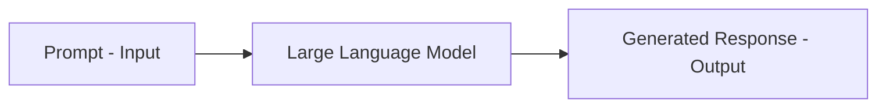

# Prompts and Prompt Engineering

## What Is a Prompt?

A **prompt** is the input provided to an LLM that initiates text generation. It is the sole interface for controlling model behaviour in most applications — there is no traditional API to "program" an LLM's logic directly.

A prompt can contain:

- **Instructions** — what task to perform
- **Context** — background information or source text
- **Examples** — demonstrations of desired input-output pairs
- **Constraints** — style, length, format, or tone requirements

There is no single "correct" prompt — only more or less effective ones for a given task.

---

## What Is Prompt Engineering?

**Prompt engineering** is the practice of designing inputs that guide the model toward the desired output.

> Garbage in → garbage out.

No matter how powerful the model, poor input produces poor output. Because LLMs generate text entirely from the prompt:

- The same model can produce radically different outputs with different prompts
- Small wording changes can significantly alter results
- Unlike traditional software, behaviour is **described**, not **coded**

---

## Prompt vs Traditional Programming

| Aspect | Traditional Code | LLM + Prompt |
|--------|------------------|--------------|
| Control mechanism | Explicit logic (if/else, functions) | Natural-language description |
| Behaviour change | Modify code | Modify prompt |
| Determinism | High (same input → same output) | Variable (sampling involved) |
| Flexibility | Rigid, precise | Flexible, probabilistic |

---

## Why Prompt Engineering Is a Core Skill

Industrial LLM applications — customer support bots, code assistants, document summarisers, quiz generators — all depend on prompt quality. A well-crafted prompt can make a smaller, cheaper model outperform a larger one with a vague prompt.

Key principles:

- Output depends entirely on input
- Specificity reduces ambiguity
- Iteration is expected — prompt design is experimental
- Constraints (format, length, tone) must be explicit

---

## Common Pitfalls / Exam Traps

- **Assuming bigger models eliminate need for good prompts** — prompt quality always matters.
- **Treating prompts as one-time setup** — prompt engineering is iterative and task-specific.
- **Vague instructions expecting precise output** — "summarise this" vs "summarise in 3 bullet points under 100 words" produce very different results.
- **Confusing system prompt with user prompt** — system instructions set persistent behaviour; user prompt carries the task.

---

## Quick Revision Summary

- A prompt is the LLM input that triggers text generation.
- Prompts can include instructions, context, examples, and constraints.
- Prompt engineering designs inputs for desired outputs.
- LLM behaviour is described through prompts, not coded explicitly.
- Small prompt changes can significantly affect results.
- No universal best prompt — effectiveness is task-dependent.
