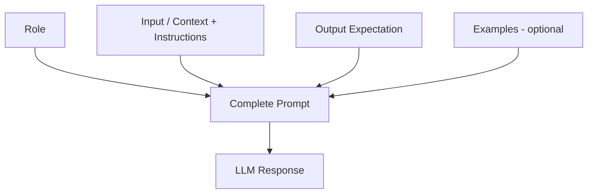

# Core Components of a Prompt

## Why Structure Matters

Unstructured prompts produce inconsistent outputs. A well-structured prompt reduces ambiguity and gives the model clear signals about role, task, and expected response format.

---

## The Four Components

| Component | Purpose | Required? |
|-----------|---------|-----------|
| **Role** | Who the model acts as; who the audience is | Recommended |
| **Input** | Context, data, or instructions for the task | Required |
| **Output expectation** | Format, tone, depth, length | Recommended |
| **Examples** | Demonstrations of desired behaviour | Optional |



---

## 1. Role

Defines the persona the model should adopt and optionally the target audience.

**Example:**
> You are a math teacher explaining concepts to 3rd graders.

| Element | Value |
|---------|-------|
| Model role | Math teacher |
| Audience | 3rd graders |

The role shapes vocabulary, analogies, and explanation depth.

---

## 2. Input

Provides the information the model uses to generate a response. Can be:

- **Context only** — a paragraph to summarise
- **Instruction only** — "Explain overfitting in machine learning"
- **Both** — context plus specific instructions about what to do with it

---

## 3. Output Expectation

Specifies how the response should look:

| Constraint Type | Examples |
|-----------------|----------|
| Format | "Respond in 3 bullet points", "Return raw JSON" |
| Length | "Limit to 100 words" |
| Tone | Friendly, constructive, formal, sarcastic |
| Style | Simple language, poetic, literary, technical |
| Depth | Beginner overview vs expert analysis |

Clear structure reduces ambiguity and improves consistency.

---

## Worked Example: Teaching Quantum Physics

```
You are a physics teacher conducting a class for 3rd grade.

Explain the top 3 concepts of quantum physics.
Use analogies to explain each concept.
Tie back each concept to its respective analogy.
Use simple language and a friendly tone.
```

| Component | Content |
|-----------|---------|
| Role | Physics teacher for 3rd graders |
| Input | Explain top 3 quantum physics concepts with analogies |
| Output expectation | Simple language, friendly tone, analogy-linked explanations |

---

## 4. Examples (Optional)

Demonstrations of input-output pairs — covered in detail under zero-shot, one-shot, and few-shot prompting. Examples anchor format and style when the task is complex or output structure matters.

---

## Common Pitfalls / Exam Traps

- **Omitting output format specification** — leads to inconsistent structure across runs.
- **Confusing role with instruction** — "You are a lawyer" is role; "Summarise this contract" is instruction.
- **Vague output expectations** — "be concise" is weaker than "respond in exactly 3 bullet points, max 50 words each".
- **Skipping role for educational content** — audience-appropriate language requires explicit role/audience definition.
- **Listing only 3 components and forgetting examples** — exams may ask about all four.

---

## Quick Revision Summary

- Four prompt components: Role, Input, Output expectation, Examples (optional).
- Role defines model persona and target audience.
- Input provides context, instructions, or both.
- Output expectation specifies format, tone, depth, and length.
- Clear structure reduces ambiguity and improves output quality.
- Examples (one-shot/few-shot) further anchor format when needed.
