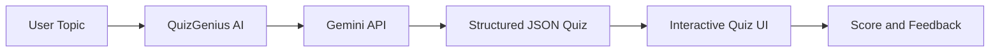

# QuizGenius AI: Capstone Project Overview

## Project Goal

**QuizGenius AI** is an LLM-powered application that dynamically generates multiple-choice quizzes on any user-specified topic. Built with the **Gemini API**, it demonstrates how generative AI integrates into interactive, educational applications — a template adaptable to any domain.

The capstone progresses from a Jupyter notebook proof-of-concept to a full-stack Streamlit application with proper API key management, structured JSON output, and a browser-based UI.

---

## Key Features

| Feature | Description |
|---------|-------------|
| **Dynamic quiz generation** | 3-question MCQ on any user-specified topic |
| **Intermediate difficulty** | Challenging yet accessible questions |
| **Structured JSON output** | Consistent, parseable quiz data from the LLM |
| **Interactive UI** | Real-time answer submission and immediate feedback |
| **Secure API key management** | Keys stored via Colab Secrets or `.env`, never hardcoded |

---

## Why Structured JSON Output Matters

Industrial LLM applications rarely consume free-form text. They need **machine-parseable output** to drive downstream logic — rendering UI components, storing in databases, or triggering workflows. Enforcing JSON schema via prompt design and API configuration is a high-demand production skill.

---

## Technology Stack

| Layer | Technology |
|-------|------------|
| LLM | Google Gemini (via `google.genai` SDK) |
| Notebook POC | Jupyter / Google Colab |
| Full-stack UI | Streamlit (`app.py`) |
| Backend logic | Python (`quiz_engine.py`) |
| Secrets | `.env` file / Colab `userdata` |
| Version control | GitHub |

---

## Learning Outcomes

- Integrate Gemini API into a Python application
- Design prompts that produce consistent structured output
- Parse and validate LLM JSON responses
- Build interactive NLG applications beyond notebooks
- Manage API keys securely in development and deployment

---

## Extension Ideas

Adapt the template to other domains:

- **HR:** Policy comprehension quizzes for onboarding
- **Cloud:** AWS service knowledge checks for certification prep
- **Healthcare:** Patient education quizzes on treatment plans
- **Legal:** Clause understanding tests for contract review training

---

## Common Pitfalls / Exam Traps

- **Hardcoding API keys in source code** — security violation; use secrets management.
- **Accepting free-form LLM text without JSON parsing** — breaks automated UI rendering.
- **Ignoring LLM factual errors in quiz answers** — generated questions may be incorrect; add disclaimers.
- **Treating notebook POC as production-ready** — full-stack deployment requires validation, secrets, and error handling.

---

## Quick Revision Summary

- QuizGenius AI: Gemini-powered MCQ quiz generator on any topic.
- Features: dynamic generation, JSON output, interactive UI, secure API keys.
- Structured JSON from LLMs is critical for industrial applications.
- Template is domain-agnostic — adapt to education, cloud, HR, etc.
- Capstone builds from notebook POC to full-stack Streamlit app.
- Intermediate difficulty, 3 MCQs with A/B/C/D options and explanations.
