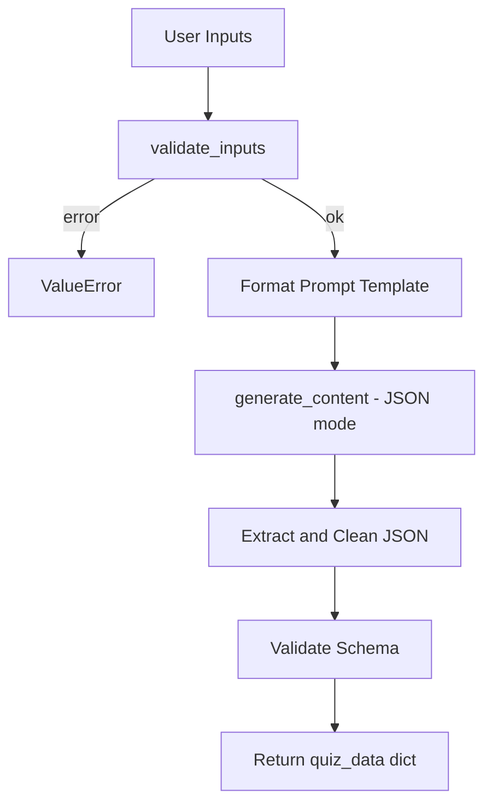

# Building the Backend (`quiz_engine.py`)

## Backend Responsibilities

The backend module handles everything between user input and LLM response:

1. Load environment variables and initialise Gemini client
2. Validate user inputs before API calls
3. Format the prompt template
4. Call Gemini API with JSON response mode
5. Parse, clean, and validate the JSON response



---

## Environment and Client Setup

```python
import json, re, os
from dotenv import load_dotenv
from google import genai
from google.genai import types

load_dotenv()
gemini_api_key = os.getenv("GEMINI_API_KEY")
model_name = os.getenv("MODEL_NAME", "gemini-2.5-flash")

if not gemini_api_key:
    raise ValueError("GEMINI_API_KEY is missing. Please check your .env file.")

client = genai.Client(api_key=gemini_api_key)
```

---

## Input Validation

Validation runs **before** the LLM call to save API cost and ensure pipeline consistency.

### Constants

```python
VALID_DIFFICULTIES = ["easy", "intermediate", "hard"]
MAX_TOPIC_LENGTH = 200
MAX_QUESTIONS = 10
MIN_QUESTIONS = 1
```

### `validate_inputs(topic, num_questions, difficulty)`

| Check | Error Message |
|-------|---------------|
| Empty topic | "Topic cannot be empty" |
| Topic > 200 chars | "Topic is too long. Please keep it under 200 characters" |
| Questions not in [1, 10] | "Number of questions must be between 1 and 10" |
| Invalid difficulty | "Difficulty must be one of: easy, intermediate, hard" |
| All valid | Returns `None` |

---

## `generate_quiz(topic, num_questions=3, difficulty="intermediate")`

```python
def generate_quiz(topic: str, num_questions: int = 3,
                difficulty: str = "intermediate") -> dict:
    error = validate_inputs(topic, num_questions, difficulty)
    if error:
        raise ValueError(error)

    prompt = prompt_template.format(
        topic=topic.strip(),
        num_questions=num_questions,
        difficulty=difficulty
    )

    try:
        response = client.models.generate_content(
            model=model_name,
            contents=prompt,
            config=types.GenerateContentConfig(
                response_mime_type="application/json"
            )
        )
        raw_text = response.text
        match = re.search(r'\{.*\}', raw_text, re.DOTALL)
        json_string = match.group(0) if match else raw_text
        json_string = re.sub(r'```json|```', '', json_string).strip()
        quiz_data = json.loads(json_string)

        if "questions" not in quiz_data:
            raise ValueError("LLM response missing 'questions' key")

        return quiz_data

    except json.JSONDecodeError as e:
        raise ValueError(f"Failed to parse quiz JSON: {e}")
    except Exception as e:
        raise RuntimeError(f"Quiz generation failed: {e}")
```

---

## Why Validation Matters

| Benefit | Explanation |
|---------|-------------|
| Cost savings | Invalid inputs never reach the paid API |
| Consistency | Gibberish topics and bizarre question counts are rejected |
| Security | Length limits prevent prompt injection via oversized inputs |
| Reliability | Schema check catches malformed LLM responses early |

---

## Common Pitfalls / Exam Traps

- **Skipping validation and calling LLM directly** — wastes tokens and money.
- **No schema validation after JSON parse** — missing `questions` key crashes frontend.
- **Missing `except` block for try** — incomplete error handling causes unhandled crashes.
- **Hardcoding model name in code** — use `.env` with fallback default.
- **Not stripping topic whitespace** — leading spaces produce odd quiz content.

---

## Quick Revision Summary

- Backend: env setup → validation → prompt format → API call → JSON parse → schema check.
- `validate_inputs()` checks topic, question count, and difficulty before API call.
- `generate_quiz()` returns dict with `quiz_title` and `questions` or raises errors.
- `response_mime_type="application/json"` enforces structured output.
- Validate `"questions"` key exists in parsed response.
- Handle `JSONDecodeError` and general exceptions separately.
