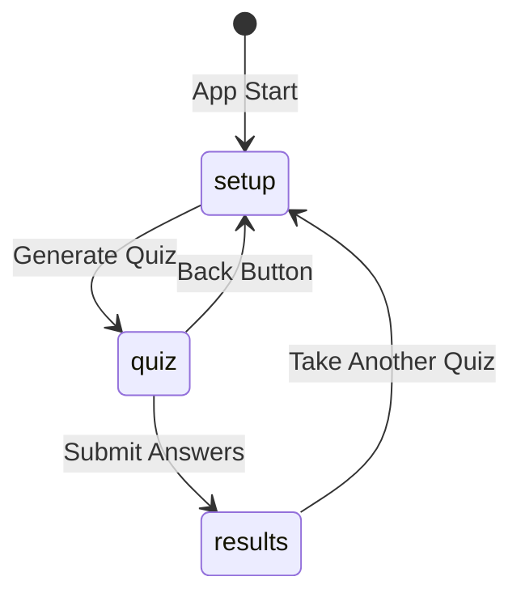

# Building the Frontend (`app.py`)

## Streamlit Overview

Streamlit (`st`) enables Python developers to build browser UIs without HTML/CSS. QuizGenius AI uses three screens managed by **session state** — because Streamlit reruns the entire script on every user interaction.

---

## Page Configuration

```python
st.set_page_config(
    page_title="QuizGenius AI",
    page_icon="🧠",
    layout="centered"
)
```

| Setting | Effect |
|---------|--------|
| `page_title` | Browser tab title |
| `page_icon` | Favicon |
| `layout="centered"` | Content centred with side padding (vs `wide`) |

---

## Session State Management

Streamlit reruns the full script on every button click or input change. Session state persists data across reruns.

```python
def init_session_state():
    defaults = {
        "quiz_data": None,       # Generated quiz JSON
        "user_answers": {},      # {question_index: "A"/"B"/"C"/"D"}
        "submitted": False,      # Whether answers submitted
        "current_step": "setup"  # "setup" | "quiz" | "results"
    }
    for key, value in defaults.items():
        if key not in st.session_state:
            st.session_state[key] = value
```



---

## Screen 1: Setup Form (`render_setup_form`)

| UI Element | Streamlit Widget | Purpose |
|------------|------------------|---------|
| Header | `st.header` | "Configure Your Quiz" |
| Topic | `st.text_input` | Free-text topic entry |
| Question count | `st.slider` | MIN_QUESTIONS to MAX_QUESTIONS (default 3) |
| Difficulty | `st.selectbox` | easy / intermediate / hard |
| Submit | `st.form_submit_button` | "Generate Quiz!" |

On submit:
1. Validate topic is not empty
2. Show spinner: "Generating your quiz..."
3. Call `generate_quiz(topic, num_questions, difficulty)` from backend
4. Store result in `st.session_state.quiz_data`
5. Set `current_step = "quiz"` and `st.rerun()`

---

## Screen 2: Quiz Page (`render_quiz`)

- Display `quiz_data["quiz_title"]` as header
- Loop through questions with `st.radio` for A/B/C/D selection
- Store selections in `st.session_state.user_answers`
- **Submit Answers** button (width ratio 3) — validates all questions answered
- **Back** button (width ratio 1) — calls `reset_quiz()` and returns to setup

---

## Screen 3: Results Page (`render_results`)

### Score Calculation

```python
score = sum(
    1 for i, q in enumerate(questions)
    if user_answers.get(i) == q["correct_option"]
)
percentage = (score / total) * 100
```

### Feedback Tiers

| Percentage | Message |
|------------|---------|
| 100% | Trophy emoji — "Perfect score! You're a master!" |
| > 70% | "Great job! You know your stuff!" |
| > 40% | "Good effort! Keep studying!" |
| ≤ 40% | "Keep learning!" |

### Detailed Review

Per question:
- Correct answer: green checkmark (`st.success`)
- Wrong answer: red cross (`st.error`) + correct option shown
- Explanation from `q["explanation"]` via `st.info`

**Take Another Quiz** button resets state and returns to setup.

---

## Main App Router (`main()`)

```python
def main():
    init_session_state()
    st.title("QuizGenius AI")
    st.caption("Generate AI-powered quizzes on any topic in seconds.")

    if st.session_state.current_step == "setup":
        render_setup_form()
    elif st.session_state.current_step == "quiz":
        render_quiz()
    elif st.session_state.current_step == "results":
        render_results()
```

---

## Common Pitfalls / Exam Traps

- **Not using session state** — quiz data lost on every rerun.
- **Forgetting `st.rerun()` after state change** — UI does not transition to next screen.
- **Hardcoding 3 questions in UI** — use `len(quiz_data["questions"])` dynamically.
- **Not validating all questions answered before submit** — partial submissions skew scoring.
- **Mixing backend logic in `app.py`** — import from `quiz_engine.py` only.

---

## Quick Revision Summary

- Streamlit frontend: 3 screens (setup, quiz, results) routed by `current_step`.
- Session state persists `quiz_data`, `user_answers`, `submitted`, `current_step`.
- Setup: topic input, question slider, difficulty selectbox, generate button.
- Quiz: radio buttons per question, submit/back buttons.
- Results: score percentage, tiered feedback, per-question review with explanations.
- `main()` routes to correct screen based on session state.
- Always call `st.rerun()` after state transitions.
