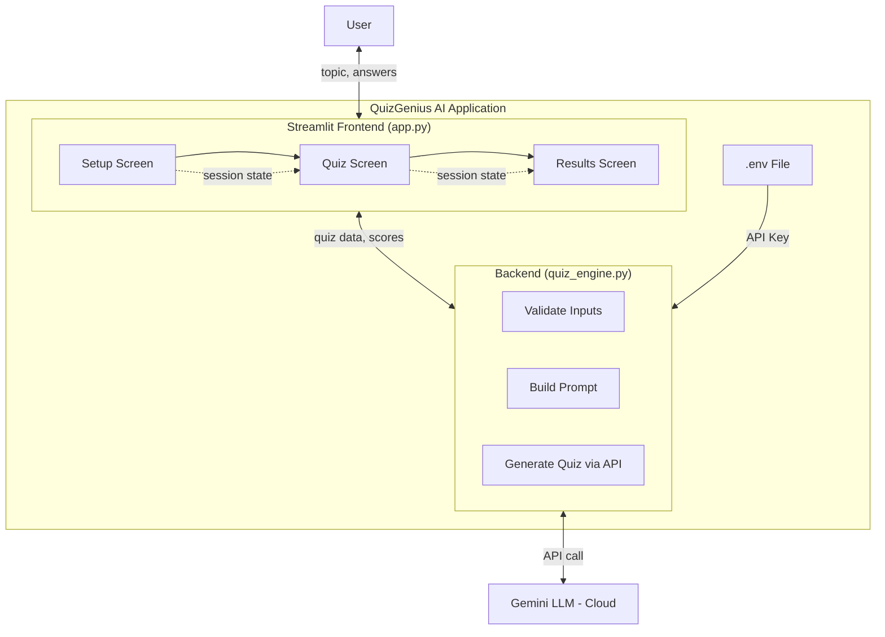

# Updated Project Architecture (v2)

## From v1 to v2

After implementing the full-stack application, the architecture diagram is updated to reflect actual file names, screen flows, backend steps, and secrets management. Real projects routinely revise architecture post-implementation based on optimisation needs and changing requirements.

---

## Architecture v2 Diagram



---

## Component Details (v2)

### Frontend: `app.py` (Streamlit)

| Screen | Function | Session State |
|--------|----------|---------------|
| Setup | `render_setup_form()` | `current_step = "setup"` |
| Quiz | `render_quiz()` | `current_step = "quiz"` |
| Results | `render_results()` | `current_step = "results"` |

All screens managed via `st.session_state` — persists data across Streamlit reruns.

### Backend: `quiz_engine.py`

| Step | Function |
|------|----------|
| 1 | `validate_inputs()` — topic, question count, difficulty |
| 2 | Format `prompt_template` with user parameters |
| 3 | `generate_quiz()` — API call + JSON parse + schema validation |

### API Management: `.env`

```
GEMINI_API_KEY=your_key
MODEL_NAME=gemini-2.5-flash
```

Connected to backend via `python-dotenv` → `os.getenv()`. Never committed to Git.

---

## v1 vs v2 Changes

| Aspect | v1 (Conceptual) | v2 (Implemented) |
|--------|-----------------|------------------|
| Frontend detail | "Browser UI" | Streamlit, 3 named screens |
| Backend detail | "Python logic" | `quiz_engine.py` with validation pipeline |
| Secrets | Not shown | `.env` file with API key connection |
| Session management | Not shown | `st.session_state` with `current_step` |
| File names | Generic | `app.py`, `quiz_engine.py` |

---

## Complete Project Structure (v2)

```
quiz-genius-ai/
├── .env
├── .gitignore
├── LICENSE
├── README.md
├── requirements.txt
├── quiz_engine.py      # Backend logic
└── app.py              # Streamlit frontend (3 screens)
```

---

## Portfolio and Next Steps

- Push completed project to GitHub with updated README and architecture diagram
- Add disclaimer: "AI-generated quizzes may contain inaccuracies"
- Experiment with prompt tweaks (difficulty descriptions, question styles)
- Adapt template to other domains (cloud certification, corporate training)
- Frontend teams can later replace Streamlit with production-grade React UI

---

## Common Pitfalls / Exam Traps

- **Not updating architecture after implementation** — v1 diagrams become misleading documentation.
- **Omitting `.env` from architecture** — secrets management is a core production concern.
- **Drawing frontend as single box** — three screens with session routing is the actual design.
- **Forgetting session state in architecture** — critical for understanding Streamlit apps.
- **Skipping README architecture diagram** — essential for portfolio reviewers.

---

## Quick Revision Summary

- Architecture v2 reflects actual implementation details post-build.
- Frontend: Streamlit `app.py` with 3 session-managed screens.
- Backend: `quiz_engine.py` — validate → prompt → generate → parse.
- `.env` provides API key to backend; never in version control.
- v2 adds file names, screen flow, validation pipeline, and secrets.
- Update architecture diagrams after implementation — industry standard practice.
- Project ready for GitHub portfolio with README and architecture snapshot.
