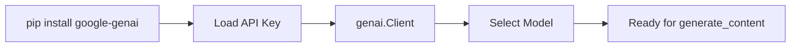

# Package Installation and API Setup

## Environment Setup Overview

Before building QuizGenius AI, install the Gemini SDK, configure imports, and securely load the API key. This setup pattern applies to any Gemini-based Python project.

---

## Package Installation

```bash
pip install google-genai
```

### Required Imports

```python
import json
import re
from google import genai
from google.genai import types
```

| Package | Purpose |
|---------|---------|
| `json` | Parse structured LLM responses |
| `re` | Regex cleanup of JSON strings |
| `google.genai` | Gemini SDK client and types |
| `google.genai.types` | Configuration objects (e.g., response MIME type) |

---

## API Key Configuration

### Insecure (Demo Only)

```python
api_key = "paste_key_here"  # NOT recommended for production
```

### Secure: Colab Secrets

```python
from google.colab import userdata
gemini_api_key = userdata.get("GEMINI_API_KEY")
```

Store the key in Colab Secrets panel with name `GEMINI_API_KEY`.

### Secure: Environment Variables (Production)

```bash
# .env
GEMINI_API_KEY=your_key_here
MODEL_NAME=gemini-2.5-flash
```

```python
import os
from dotenv import load_dotenv
load_dotenv()
api_key = os.getenv("GEMINI_API_KEY")
```

---

## Client and Model Initialisation

```python
client = genai.Client(api_key=gemini_api_key)
model_name = "gemini-2.5-flash"  # fast, cost-effective for POCs
```

**Gemini 2.5 Flash** is a lighter, faster, more cost-effective variant — ideal for demos and proof-of-concepts. Model names can also be stored in `.env` as `MODEL_NAME` to avoid hardcoding.



---

## Fail-Safe Pattern

```python
if not gemini_api_key:
    raise ValueError("GEMINI_API_KEY is missing. Please check your .env file.")
```

Stop early if the key is missing — prevents silent failures and cryptic API errors downstream.

---

## Common Pitfalls / Exam Traps

- **Pasting API keys directly in notebook cells** — keys get committed to Git or shared notebooks.
- **Forgetting `genai.Client(api_key=...)`** — library import alone does not authenticate.
- **Using heavyweight models for simple demos** — Flash variants reduce cost and latency.
- **Not validating key presence before API calls** — add explicit checks with clear error messages.
- **Confusing `google-generativeai` (old) with `google-genai` (new SDK)** — use the current SDK per documentation.

---

## Quick Revision Summary

- Install `google-genai`; import `genai` and `types`.
- Load API key via Colab Secrets or `.env` — never hardcode.
- Initialise `genai.Client(api_key=...)` before any API calls.
- Use `gemini-2.5-flash` for fast, cost-effective POCs.
- Add fail-safe: raise error if API key is missing.
- Also import `json` and `re` for response parsing.
