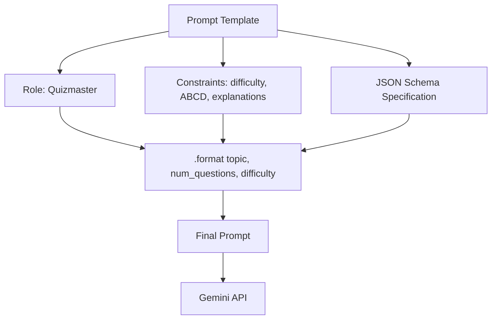

# Creating the Quiz Prompt Template

## Why a Template?

A **prompt template** is a reusable string with placeholders (`{topic}`, `{num_questions}`, `{difficulty}`) filled at runtime. It encodes role, constraints, and output schema in one place — ensuring every quiz request follows the same structure.

---

## Template Structure

### Role and Instruction

```
You are a quizmaster.
Generate a {num_questions}-question multiple choice quiz about {topic}.
```

| Component | Value |
|-----------|-------|
| Role | Quizmaster |
| Task | Generate N-question MCQ about user topic |

### Constraints

| Rule | Specification |
|------|---------------|
| Difficulty | Intermediate (configurable: easy / intermediate / hard) |
| Options | Exactly 4 options: A, B, C, D (uppercase only) |
| Correct answer | Marked clearly per question |
| Explanation | Short explanation for each correct answer |

Specificity prevents ambiguous output — the model knows exactly how many options, what labels, and what extras to include.

---

## Output Format: JSON Schema

```
Return a raw JSON with this structure only:
```

```json
{
  "quiz_title": "Catchy Title Here",
  "questions": [
    {
      "id": 1,
      "text": "Question text here?",
      "options": {
        "A": "Option A text",
        "B": "Option B text",
        "C": "Option C text",
        "D": "Option D text"
      },
      "correct_option": "B",
      "explanation": "Why B is correct."
    }
  ]
}
```

**"Raw JSON"** and **"this structure only"** are critical phrases — they reduce markdown wrapping and extraneous text around the JSON.



---

## Runtime Formatting

```python
prompt = prompt_template.format(
    topic=topic.strip(),
    num_questions=num_questions,
    difficulty=difficulty
)
```

User input is injected at call time. `.strip()` removes leading/trailing whitespace for consistency.

---

## Design Principles Applied

| Principle | How Applied |
|-----------|-------------|
| Explicit task | "Generate N-question MCQ about {topic}" |
| Format specification | Full JSON schema with sample keys |
| Constraints | Difficulty, option labels, explanations |
| Role | Quizmaster persona |

---

## Common Pitfalls / Exam Traps

- **Not specifying "raw JSON"** — model wraps output in markdown code fences, breaking `json.loads()`.
- **Vague option format** — "4 options" without "A, B, C, D uppercase" produces numbered or lowercase labels.
- **Omitting example schema** — LLM may invent different key names (`question` vs `text`, `answer` vs `correct_option`).
- **Hardcoding topic in template** — use placeholders for dynamic user input.
- **Skipping explanation requirement** — feedback screen needs explanations; must be in prompt.

---

## Quick Revision Summary

- Prompt template: reusable string with `{topic}`, `{num_questions}`, `{difficulty}` placeholders.
- Role: quizmaster; constraints: difficulty, 4 uppercase options, explanations.
- Output: raw JSON with `quiz_title` and `questions` array.
- Each question: `id`, `text`, `options` (A–D), `correct_option`, `explanation`.
- Format with `.format()` at runtime after user input.
- Explicit JSON schema in prompt is essential for parseable industrial output.
