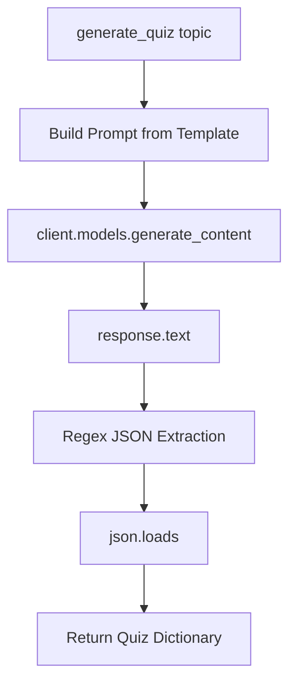

# Building the Quiz Generation Logic

## The `generate_quiz()` Function

The core backend function accepts a topic, calls the Gemini API with the prompt template, and returns parsed JSON quiz data.



---

## API Call with Structured Output

```python
def generate_quiz(topic: str) -> dict:
    print(f"Generating a quiz on topic: {topic}")

    response = client.models.generate_content(
        model=model_name,
        contents=prompt_template.format(topic=topic),
        config=types.GenerateContentConfig(
            response_mime_type="application/json"
        )
    )
```

**`response_mime_type="application/json"`** instructs the API to return JSON-formatted output — a critical setting for industrial structured generation.

---

## Response Extraction and Cleaning

```python
raw_text = response.text

# Extract JSON block via regex
pattern = r'\{.*\}'
match = re.search(pattern, raw_text, re.DOTALL)
clean_json_string = match.group(0) if match else raw_text

# Remove markdown artifacts
clean_json_string = re.sub(r'```json|```', '', clean_json_string).strip()

quiz_data = json.loads(clean_json_string)
return quiz_data
```

| Step | Purpose |
|------|---------|
| `response.text` | Extract raw string from API response |
| Regex extraction | Isolate JSON object from surrounding text |
| Markdown cleanup | Remove `` ```json `` fences if present |
| `json.loads()` | Parse into Python dictionary |

---

## Error Handling

```python
try:
    # ... generation logic ...
except json.JSONDecodeError as e:
    raise ValueError(f"Failed to parse quiz JSON: {e}")
except Exception as e:
    raise RuntimeError(f"Quiz generation failed: {e}")
```

Always wrap LLM calls in try/except — API failures, malformed JSON, and network errors are common in production.

---

## Extended Version (Full-Stack App)

The production `quiz_engine.py` version adds:

- **Input validation** before API call (topic length, question count range, valid difficulty)
- **Dynamic prompt formatting** with `{topic}`, `{num_questions}`, `{difficulty}`
- **Schema validation** — verify `"questions"` key exists in parsed JSON
- **Fail-fast on missing API key**

---

## Common Pitfalls / Exam Traps

- **Skipping `response_mime_type="application/json"`** — increases free-text wrapping and parsing failures.
- **Not using regex to extract JSON** — LLMs may add preamble text before the JSON object.
- **No `json.JSONDecodeError` handling** — malformed responses crash the app.
- **Trusting LLM JSON without schema validation** — verify required keys (`questions`, `quiz_title`) exist.
- **Calling API before input validation** — wastes tokens and cost on invalid inputs.

---

## Quick Revision Summary

- `generate_quiz(topic)` calls Gemini with formatted prompt template.
- Set `response_mime_type="application/json"` for structured output.
- Extract text → regex JSON extraction → markdown cleanup → `json.loads()`.
- Wrap in try/except for `JSONDecodeError` and general exceptions.
- Production version adds input validation and schema checks.
- Never call the LLM before validating user inputs.
