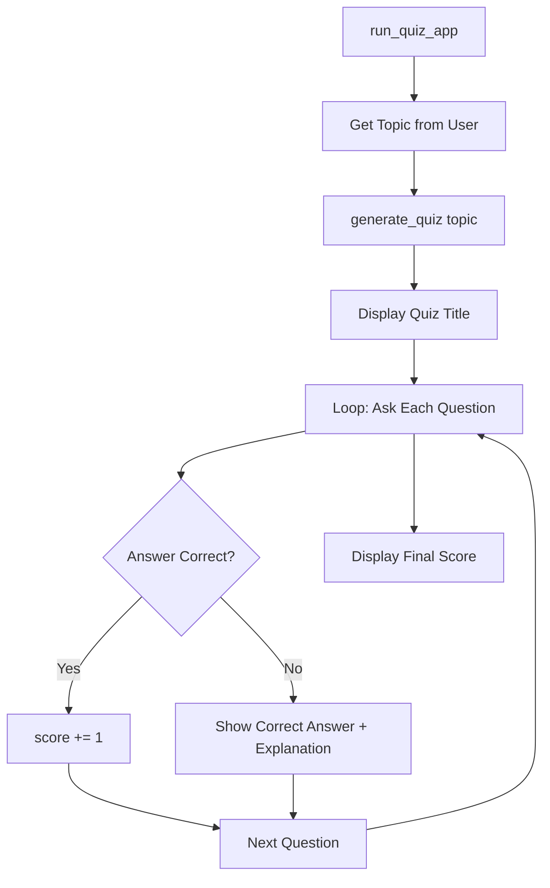

# Building the Main Application Runner

## The `run_quiz_app()` Function

The application runner orchestrates the full quiz lifecycle: collect user input, generate quiz, run the interactive game loop, and display final results. This is the notebook POC entry point before the Streamlit full-stack version.



---

## Step-by-Step Logic

### 1. User Input

```python
topic = input("What topic do you want to be quizzed on? ")
# topic = "mathematics"  # hardcoded alternative for testing
```

### 2. Generate Quiz

```python
quiz_data = generate_quiz(topic)
if not quiz_data:
    print("Failed to generate quiz.")
    return
```

### 3. Display Quiz

```python
print(quiz_data["quiz_title"])
score = 0
total = len(quiz_data["questions"])
```

`total` is computed dynamically — changing question count in the prompt does not require code changes.

### 4. Question Loop

```python
for q in quiz_data["questions"]:
    print(q["text"])
    for key, value in q["options"].items():
        print(f"  {key}: {value}")

    user_answer = input("Your answer (A/B/C/D): ").strip().upper()

    if user_answer == q["correct_option"]:
        print("Correct!")
        score += 1
    else:
        print(f"Wrong. The answer was {q['correct_option']}.")
        print(f"Explanation: {q['explanation']}")

    time.sleep(1)  # pause between questions
```

### 5. Final Score

```python
print(f"Final score: {score}/{total}")

if score == total:
    print("Perfect score! You are a master!")
elif score > 0:
    print("Good job! Keep studying.")
else:
    print("Better luck next time.")
```

---

## JSON Structure Reference

Understanding the data shape is essential for writing the loop:

```json
{
  "quiz_title": "Math Master's Challenge",
  "questions": [
    {
      "id": 1,
      "text": "What is the integral of x^2?",
      "options": {"A": "...", "B": "...", "C": "...", "D": "..."},
      "correct_option": "A",
      "explanation": "The integral of x^2 is x^3/3 + C."
    }
  ]
}
```

| Access Pattern | Meaning |
|----------------|---------|
| `quiz_data["quiz_title"]` | Quiz name |
| `quiz_data["questions"]` | List of question dicts |
| `q["text"]` | Question text |
| `q["options"]` | Dict of A/B/C/D options |
| `q["correct_option"]` | Correct label |
| `q["explanation"]` | Why the answer is correct |

---

## Common Pitfalls / Exam Traps

- **Hardcoding `total = 3`** — use `len(quiz_data["questions"])` for dynamic question counts.
- **Case-sensitive answer comparison** — normalise with `.strip().upper()`.
- **Not handling failed quiz generation** — check for `None` or empty response before looping.
- **Accessing wrong JSON keys** — `correct_option` not `answer` or `correct_answer` (depends on prompt schema).
- **Skipping explanation on wrong answers** — explanations aid learning; always display them.

---

## Quick Revision Summary

- `run_quiz_app()`: input topic → generate → loop questions → score → feedback.
- `total = len(quiz_data["questions"])` keeps question count dynamic.
- Normalise user answers with `.strip().upper()`.
- Correct: increment score; wrong: show correct option and explanation.
- Final messages based on score/total ratio.
- `time.sleep(1)` adds pause between questions for readability.
