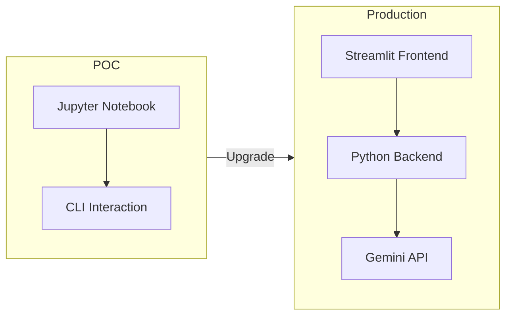

# From Notebook POC to Full-Stack Application

## Why Upgrade Beyond the Notebook?

The Jupyter notebook POC works for Python practitioners but excludes non-technical users. Industrial LLM products — ChatGPT, Gemini, Claude — became viral only when wrapped in accessible frontends, not when exposed as scripting APIs.

---

## The Full-Stack Motivation

| Notebook POC | Full-Stack App |
|--------------|----------------|
| Python users only | Any user via browser |
| Single file | Separated frontend + backend |
| Hardcoded secrets risk | `.env` secrets management |
| No input validation | Validated inputs before API calls |
| CLI text interface | Interactive forms, buttons, visual feedback |

**Portfolio impact:** A full-stack LLM application demonstrates end-to-end capability — prompting, API integration, validation, UI, and deployment — far beyond notebook-only projects.

---

## Architecture Components

| Component | File | Technology |
|-----------|------|------------|
| Frontend | `app.py` | Streamlit |
| Backend | `quiz_engine.py` | Python + Gemini SDK |
| Secrets | `.env` | `GEMINI_API_KEY`, `MODEL_NAME` |
| Dependencies | `requirements.txt` | Pinned versions |
| Docs | `README.md` | Project documentation |
| Ignore rules | `.gitignore` | Excludes `.env`, caches |

---

## Streamlit: Python Frontend Without HTML/CSS

Streamlit lets Python developers build browser UIs without HTML, CSS, or JavaScript knowledge. For NLP practitioners and AI engineers, this bridges the gap to user-facing applications. Frontend engineering teams can later replace Streamlit with React/Vue for polished production UIs.

---

## Industry Workflow

1. **AI engineer** builds logic + Streamlit prototype
2. **Software engineering team** refines frontend for production
3. **DevOps** handles deployment, secrets, monitoring

You do not need to learn frontend frameworks to demonstrate a complete LLM product.

---

## The Broader Lesson

GPT and transformer models existed years before ChatGPT's consumer launch. The **application layer** — accessible UI, session management, feedback loops — turned research into a product revolution. Building QuizGenius AI as full-stack follows the same pattern.

---

## Common Pitfalls / Exam Traps

- **Stopping at notebook POC for portfolio** — full-stack demo is significantly more impressive.
- **Assuming users will run Python scripts** — non-technical users need browser UIs.
- **Learning React before shipping** — Streamlit is sufficient for prototypes and portfolios.
- **Ignoring the product wrapper** — LLM capability alone does not make a usable product.

---

## Quick Revision Summary

- Notebook POC limits access to Python users; full-stack opens access to everyone.
- ChatGPT succeeded because of accessible UI, not just model capability.
- Full-stack: Streamlit frontend (`app.py`) + Python backend (`quiz_engine.py`).
- Streamlit enables Python-only frontend development without HTML/CSS.
- Industry pattern: AI engineer prototypes → frontend team polishes.
- Full-stack LLM apps are high-value portfolio pieces.
