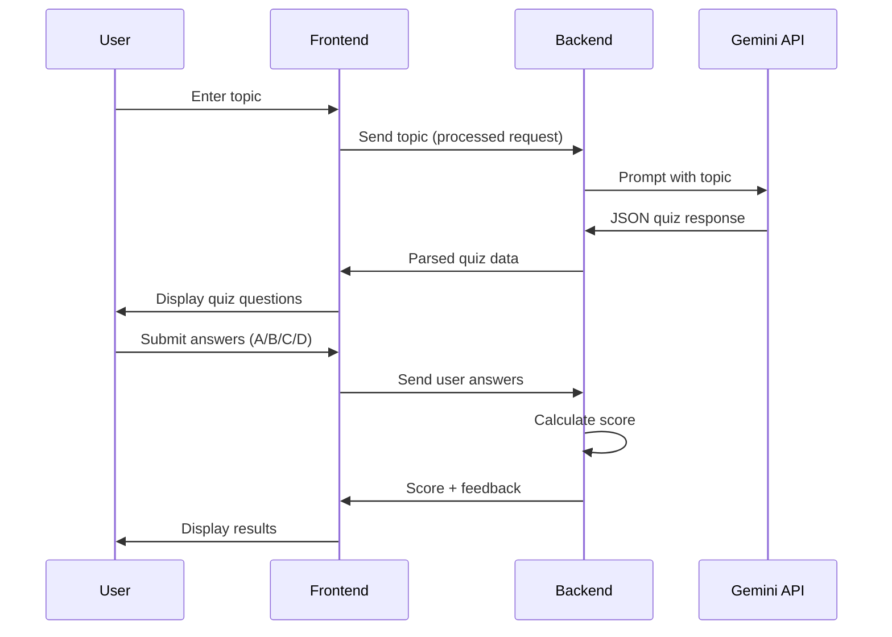
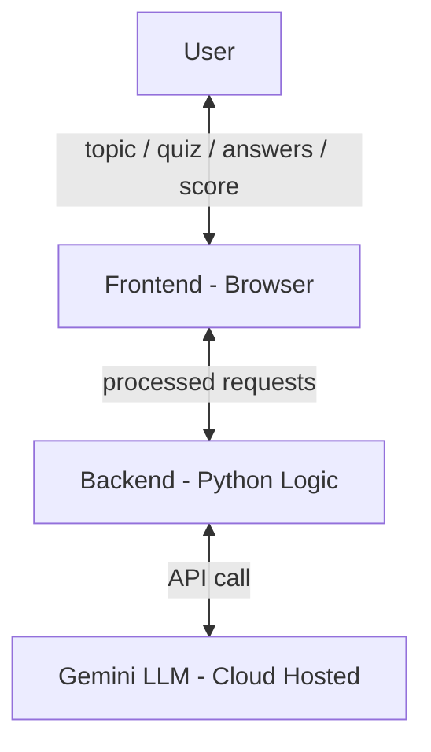

# Application Flow and Architecture (v1)

## User Journey

QuizGenius AI follows a two-phase interaction loop:

### Phase 1: Quiz Generation

1. User enters a topic (e.g., "mathematics")
2. Frontend captures and forwards to backend
3. Backend calls Gemini LLM with the prompt template
4. LLM returns JSON quiz data
5. Backend parses and sends to frontend
6. Frontend displays quiz title and questions

### Phase 2: Answer Evaluation

1. User selects answers for each question
2. Frontend sends answers to backend
3. Backend compares against `correct_option` fields
4. Backend calculates score and prepares feedback
5. Frontend displays score, per-question review, and explanations

The loop repeats when the user requests a new quiz.

---

## Architecture Diagram (v1)

**Important:** The LLM is **not inside the backend**. It is hosted on Google's cloud and accessed via API. The backend is a client, not the model host.

---

## Component Responsibilities

| Component | Responsibility |
|-----------|----------------|
| **Frontend** | User interaction, form input, quiz display, answer collection, results rendering |
| **Backend** | Input validation, prompt construction, API call, JSON parsing, score calculation |
| **Gemini API** | Quiz content generation (questions, options, explanations) |

---

## Request/Response Flow Detail

| Step | Direction | Payload |
|------|-----------|---------|
| 1 | User → Frontend | Topic string |
| 2 | Frontend → Backend | Validated topic |
| 3 | Backend → LLM | Formatted prompt |
| 4 | LLM → Backend | JSON quiz |
| 5 | Backend → Frontend | Parsed quiz object |
| 6 | Frontend → User | Quiz UI |
| 7 | User → Frontend | Selected answers |
| 8 | Frontend → Backend | Answer dict |
| 9 | Backend → Frontend | Score + per-question feedback |
| 10 | Frontend → User | Results screen |

---

## Architecture Evolution

Real projects start with a base architecture (v1) and refine after implementation:

- Add input validation layers
- Introduce `.env` for secrets
- Split into `app.py` and `quiz_engine.py`
- Add session state management in Streamlit
- Update architecture diagram to v2 after build

---

## Common Pitfalls / Exam Traps

- **Drawing LLM inside the backend box** — it is an external cloud API.
- **Skipping the two-phase flow** — generation and scoring are separate interactions.
- **Assuming frontend calls Gemini directly** — backend should mediate API calls to protect keys.
- **Not documenting architecture before coding** — leads to tangled responsibilities.
- **Treating v1 architecture as final** — iterate after implementation.

---

## Quick Revision Summary

- Two-phase flow: (1) topic → quiz generation, (2) answers → scoring.
- Frontend handles UI; backend handles logic and API calls.
- Gemini LLM is external cloud service accessed via API, not embedded in backend.
- Loop repeats for each new quiz session.
- Architecture v1 is a starting point — update after implementation (v2).
- Backend parses JSON; frontend displays structured quiz data.
