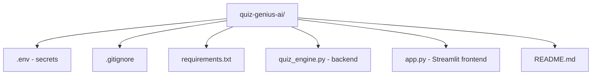

# Project Setup and Repository Structure

## Repository Initialisation

Create a GitHub repository for version control, collaboration, and portfolio visibility.

### Repository Settings

| Setting | Value |
|---------|-------|
| Name | `quiz-genius-ai` |
| Visibility | Public (or private) |
| README | Yes — project documentation |
| `.gitignore` | Python template |
| Licence | MIT (common for open source) |

```bash
git clone <repository-url>
cd quiz-genius-ai
```

---

## Project Structure

```
quiz-genius-ai/
├── .env                  # API keys and secrets (NEVER commit)
├── .gitignore            # Excludes .env, caches, IDE files
├── LICENSE               # MIT licence
├── README.md             # Documentation (updated as project evolves)
├── requirements.txt      # Pinned Python dependencies
├── quiz_engine.py        # Backend: quiz generation + validation
└── app.py                # Frontend: Streamlit UI
```



---

## File Responsibilities

| File | Purpose |
|------|---------|
| `.env` | `GEMINI_API_KEY`, `MODEL_NAME` — loaded by `python-dotenv` |
| `.gitignore` | Prevents `.env`, `__pycache__/`, `.venv/` from being committed |
| `requirements.txt` | `streamlit`, `google-genai`, `python-dotenv` with pinned versions |
| `quiz_engine.py` | Validation, prompt template, `generate_quiz()`, constants |
| `app.py` | Streamlit pages: setup, quiz, results |
| `README.md` | Setup instructions, architecture diagram, usage guide |

---

## Secrets Management

```bash
# .env (add to .gitignore)
GEMINI_API_KEY=your_key_here
MODEL_NAME=gemini-2.5-flash
```

The `.gitignore` Python template already excludes `.env`. Never upload API keys to GitHub — revoked keys and billing surprises follow quickly.

---

## Virtual Environment

```bash
conda create -n quiz-genius python=3.11 -y
conda activate quiz-genius
pip install -r requirements.txt
```

Pin versions in `requirements.txt` after installation:

```
streamlit==<version>
google-genai==<version>
python-dotenv==<version>
```

Anyone cloning the repo can reproduce the exact environment.

---

## Running the Application

```bash
conda activate quiz-genius
cd quiz-genius-ai
streamlit run app.py
```

---

## Common Pitfalls / Exam Traps

- **Committing `.env` to GitHub** — even private repos leak; use `.gitignore`.
- **No `requirements.txt`** — others cannot reproduce your environment.
- **Mixing frontend and backend in one file** — separation enables testing and maintenance.
- **Skipping README** — essential for portfolio and collaboration.
- **Not pinning dependency versions** — `pip install` without versions causes "works on my machine" failures.

---

## Quick Revision Summary

- GitHub repo with README, `.gitignore` (Python), MIT licence.
- Key files: `.env`, `quiz_engine.py` (backend), `app.py` (Streamlit frontend).
- `.env` stores `GEMINI_API_KEY` and `MODEL_NAME` — never committed.
- `requirements.txt` with pinned versions for reproducibility.
- Virtual environment: `conda create -n quiz-genius python=3.11`.
- Run: `streamlit run app.py` after activating environment.
