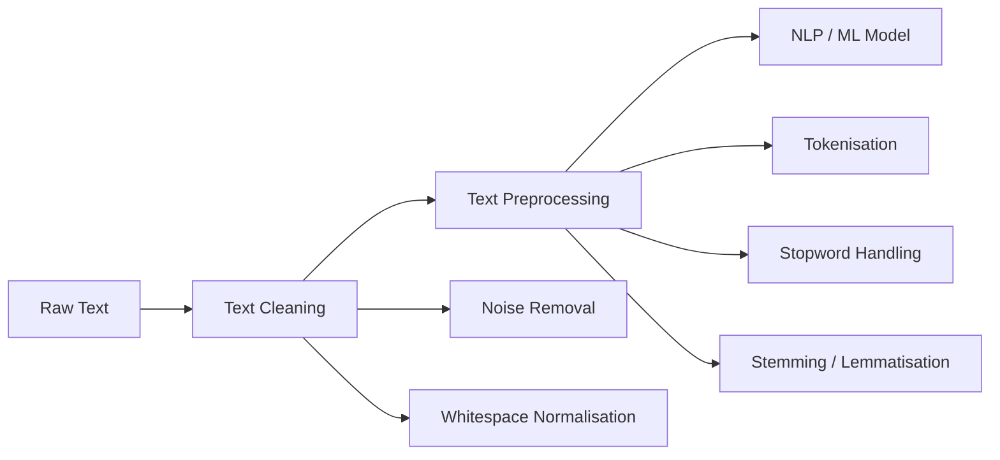

# Text Preprocessing and Cleaning: Foundations for NLP

## Why Raw Text Is Not Machine-Ready

Human language is messy: inconsistent spelling, informal grammar, HTML markup in web scrapes, emojis in social posts, and domain-specific jargon. Machine learning models and NLP algorithms operate on structured numerical representations — they cannot directly consume unstructured prose.

**Text preprocessing** transforms raw text into a form algorithms can process reliably. **Text cleaning** removes non-linguistic noise; **text preprocessing** applies linguistic normalisation. The distinction matters because cleaning without normalisation leaves surface variation intact, while normalisation without cleaning feeds garbage tokens into downstream steps.

Almost every NLP system — from classical TF-IDF classifiers to modern LLM pipelines — depends on some preprocessing stage, even when it is hidden inside a tokenizer API.

---

## Text Cleaning vs Text Preprocessing

| Aspect | Text Cleaning | Text Preprocessing |
|--------|---------------|-------------------|
| Goal | Remove unwanted elements | Normalise linguistic form |
| Examples | HTML tags, emojis, extra whitespace | Tokenisation, stemming, lemmatisation |
| Analogy | Washing vegetables | Chopping and seasoning for a recipe |
| When skipped | Structured logs with clean fields | Already tokenised subword inputs |

---

## Real-World Context

- **Customer support chatbots** must strip HTML from ticket bodies before intent classification.
- **Search engines** normalise query terms so "running," "runs," and "ran" match the same documents.
- **LLM fine-tuning pipelines** still apply cleaning when ingesting PDFs, web pages, or OCR output — garbage tokens inflate vocabulary and degrade convergence.

---

## Module Scope

This module covers both cleaning and preprocessing as a unified foundation:

1. Tokenisation — breaking text into units
2. Noise removal — regex-based cleaning
3. Stopword removal — filtering high-frequency function words
4. Stemming and lemmatisation — morphological normalisation
5. Pipeline construction — ordering steps for reproducible workflows

---

## Common Pitfalls / Exam Traps

- Treating **cleaning and preprocessing as identical** — exams may ask which step removes HTML vs which reduces "running" to "run"
- Assuming **one universal pipeline fits all tasks** — sentiment analysis keeps negation words; NER needs minimal preprocessing
- **Over-cleaning** — removing punctuation that carries meaning (e.g., "?" in QA systems)
- Believing modern LLMs make preprocessing **obsolete** — raw corpora for training still require cleaning at scale

---

## Quick Revision Summary

- Raw human text is unstructured; NLP requires machine-readable form first
- Cleaning removes noise (HTML, symbols, whitespace); preprocessing normalises linguistics
- Both steps underpin classical and modern NLP pipelines
- Task-aware design is essential — no universal cleaning rule
- Module path: tokenisation → noise removal → stopwords → stemming/lemmatisation → pipeline
