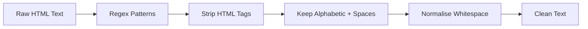

# Noise Removal with Regular Expressions

## What Is Text Noise?

In NLP, **noise** refers to text elements that do not contribute semantic meaning but inflate vocabulary and distort statistics. Common sources:

- HTML/XML tags (`<p>`, `<b>`, etc.)
- Special characters, symbols, emojis
- Extra whitespace and newline characters
- Numbers (sometimes — task-dependent)

Noise removal is a **cleaning** step that prepares text for tokenisation and modelling.

---

## Why Regular Expressions?

Regular expressions (regex) provide a flexible, pattern-based way to find and replace text at scale. Key properties:

- **Language-independent** — operates on character patterns, not grammar
- **Industry standard** — used in production ETL and NLP pipelines
- **Composable** — multiple patterns chained in sequence



---

## Common Patterns and Solutions

| Noise Type | Example Input | Target Output |
|------------|---------------|---------------|
| HTML tags | `<p>This is <b>important</b></p>` | `This is important` |
| Special chars | `@NLP!!! is awesome` | `NLP is awesome` |
| Irregular spacing | `This  sentence   has gaps` | `This sentence has gaps` |

### Removing HTML Tags

Pattern: `r'<.*?>'` — matches anything between `<` and `>` (non-greedy).

```python
import re
re.sub(r'<.*?>', '', html_text)
```

### Keeping Only Alphabetic Text

Rather than listing every unwanted symbol, invert the match:

```python
re.sub(r'[^a-zA-Z\s]', '', text)  # keep letters and spaces only
```

The `^` inside `[]` negates the character class — replace everything **except** listed characters.

### Normalising Whitespace

```python
re.sub(r'\s+', ' ', text).strip()  # collapse multiple spaces to one
```

**Important:** Replace with a single space `' '`, not empty string `''`, or words merge together.

---

## Regex Is Case-Sensitive

By default, `re.sub('important', 'Important', text)` only matches lowercase. Use `re.IGNORECASE` flag or explicit character classes when case-insensitive matching is needed.

---

## Task-Dependent Cleaning

There is **no universal cleaning rule**. Always align with the downstream task:

| Element | Remove for topic modelling? | Keep for financial NLP? |
|---------|----------------------------|-------------------------|
| Numbers | Often yes | **Must keep** |
| Emojis | Usually yes | Keep for social media sentiment |
| Punctuation | Often yes | Keep for QA and sentiment ("?" matters) |

---

## Common Pitfalls / Exam Traps

- Replacing `\s+` with **empty string** instead of single space — destroys word boundaries
- Forgetting regex is **case-sensitive** by default
- **Over-cleaning** numbers in financial or medical domains
- Using greedy `.*` instead of `.*?` for HTML — may match across multiple tags incorrectly
- Assuming cleaned text is always **lower-case** — normalisation is a separate step

---

## Quick Revision Summary

- Noise = non-meaningful elements that inflate vocabulary and hurt models
- Regex enables scalable, language-independent pattern-based cleaning
- HTML: `r'<.*?>'`; alphabetic-only: `r'[^a-zA-Z\s]'`; whitespace: `r'\s+'` → single space
- Regex is case-sensitive unless flagged otherwise
- Cleaning decisions must match the downstream NLP task — no one-size-fits-all rule
