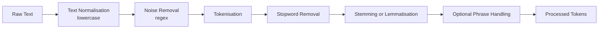

# Building a Text Preprocessing Pipeline

## Why Pipelines Matter

Individual preprocessing steps — cleaning, tokenisation, stopword removal, lemmatisation — are rarely applied in isolation. Production NLP systems chain them into a **reusable pipeline** that ensures:

- **Consistency** — same transformations on training and inference data
- **Reproducibility** — documented, ordered steps
- **Scalability** — batch processing across datasets and tasks

Incorrect step ordering can destroy information or produce inconsistent tokens.

---

## Recommended Step Order



| Step | Rationale |
|------|-----------|
| Normalise case first | Ensures consistent matching downstream |
| Clean before tokenise | Prevents HTML fragments becoming tokens |
| Tokenise before stopwords | Stopword lists operate on tokens |
| Lemmatise after stopwords | Fewer tokens to lemmatise (efficiency) |

---

## Reference Pipeline Implementation

```python
import re
import nltk
from nltk.tokenize import word_tokenize
from nltk.corpus import stopwords
from nltk.stem import WordNetLemmatizer

nltk.download('punkt')
nltk.download('stopwords')
nltk.download('wordnet')
nltk.download('omw-1.4')

stop_words = set(stopwords.words('english'))
lemmatizer = WordNetLemmatizer()

def clean_text(text):
    text = text.lower()
    text = re.sub(r'[^a-z\s]', '', text)
    text = re.sub(r'\s+', ' ', text).strip()
    return text

def tokenize(text):
    return word_tokenize(text)

def remove_stopwords(tokens):
    return [w for w in tokens if w not in stop_words]

def lemmatize_tokens(tokens):
    return [lemmatizer.lemmatize(w, pos='v') for w in tokens]

def preprocess_text(text):
    text = clean_text(text)
    tokens = tokenize(text)
    tokens = remove_stopwords(tokens)
    tokens = lemmatize_tokens(tokens)
    return tokens
```

**Example:** `"Natural Language Processing is an exciting field of AI!"` → `['natural', 'language', 'process', 'exciting', 'field', 'ai']`

---

## Task-Aware Pipeline Variants

| Task | Pipeline adjustment |
|------|---------------------|
| Sentiment analysis | Keep negation words (*not*, *never*); minimal cleaning |
| Topic modelling | Aggressive stopword removal; lemmatisation |
| Named Entity Recognition | Minimal preprocessing — preserve capitalisation and punctuation |
| Search engines | Stemming often preferred over lemmatisation for speed |

A pipeline must be **task-aware**, **data-aware**, and **flexible** — the template above is a general starting point, not a universal solution.

---

## Common Pitfalls / Exam Traps

- **Tokenising before cleaning** — HTML tags become spurious tokens
- **Removing stopwords before sentiment tasks** — loses negation
- **Same pipeline for NER and topic modelling** — NER needs original casing
- Confusing **function names with variable names** in lab code — test on diverse raw inputs
- Forgetting **punkt** and **wordnet** downloads in fresh environments

---

## Quick Revision Summary

- Pipelines chain preprocessing for consistency, reproducibility, and scale
- Order: normalise → clean → tokenise → stopwords → stem/lemmatise
- Task-specific variants: sentiment keeps negations; NER keeps minimal changes
- NLTK pipeline combines regex cleaning, `word_tokenize`, stopword filter, `WordNetLemmatizer`
- Always validate pipeline output on representative raw text before modelling
