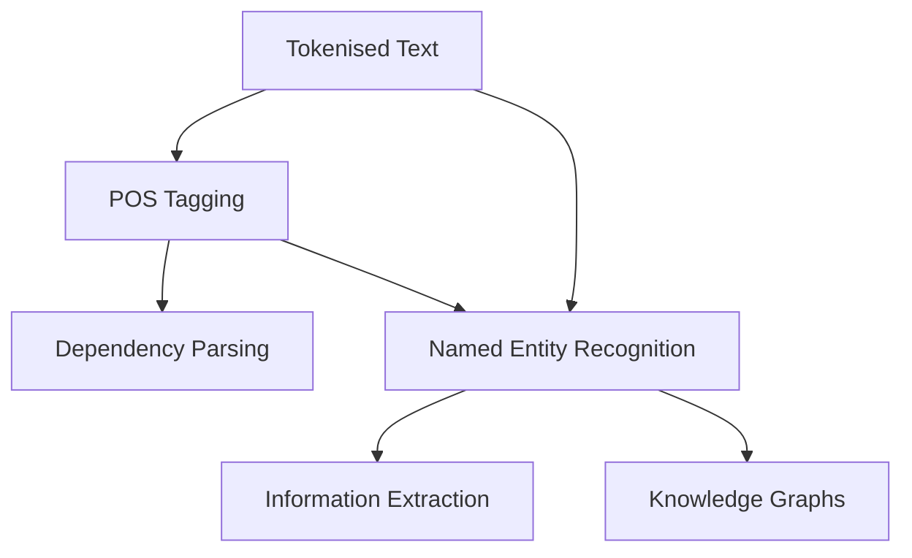

# Structural Text Analysis: POS Tagging and Named Entity Recognition

## Module Overview

This module shifts from preprocessing to **structural analysis** — understanding how words function grammatically and which tokens refer to real-world entities.

Two complementary techniques anchor the module:

| Technique | Layer | Question Answered |
|-----------|-------|-------------------|
| **Part-of-Speech (POS) Tagging** | Syntactic | What grammatical role does each word play? |
| **Named Entity Recognition (NER)** | Semantic | Which spans refer to people, organisations, locations, dates, etc.? |

Together, POS and NER form building blocks for dependency parsing, information extraction, knowledge graphs, and question-answering systems.

---

## Why Structure Matters Before Semantics

Preprocessing normalises surface form; structural analysis reveals **relationships**:

- POS tags expose syntax — nouns vs verbs, determiners vs auxiliaries
- NER maps text to ontology categories — *Google* as ORG, not just NN
- Modern models learn implicit syntax, but explicit tags remain interpretable and useful for rule-based post-processing

---

## Implementation Libraries Covered

| Library | Role in Module |
|---------|----------------|
| **spaCy** | Production-grade POS and NER with visualisation |
| **NLTK** | Traditional modular pipeline; educational baseline |
| **Flair** | Neural sequence taggers; accuracy-focused alternative |

A comparative framework helps choose the right tool for learning, production, or maximum accuracy.

---

## Common Pitfalls / Exam Traps

- Confusing **POS tagging with NER** — POS assigns grammatical categories; NER identifies real-world entity types
- Assuming POS is a **dictionary lookup** — tags are context-dependent (*book* as verb vs noun)
- Treating all three libraries as **interchangeable** — speed, accuracy, and API complexity differ significantly

---

## Quick Revision Summary

- Module focus: syntactic structure (POS) and semantic entities (NER)
- POS → grammatical roles; NER → persons, orgs, locations, dates, money
- Both underpin IE, QA, knowledge graphs, and parsing pipelines
- Implementations: spaCy (production), NLTK (fundamentals), Flair (accuracy)
- Library choice depends on speed vs accuracy vs educational goals
