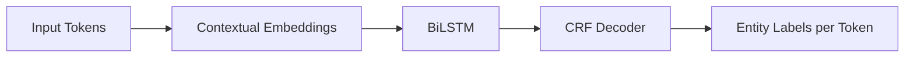

# Named Entity Recognition with Flair

## Flair for High-Accuracy NER

Flair applies **biLSTM-CRF** neural architectures with contextual string embeddings to NER. The same `SequenceTagger` framework used for POS tagging loads a dedicated NER checkpoint.

Trade-off: higher accuracy potential vs slower inference than spaCy.

---

## Implementation

```python
from flair.data import Sentence
from flair.models import SequenceTagger

tagger = SequenceTagger.load('ner')
sentence = Sentence("Apple is looking at buying a UK startup for $1 billion. Elon Musk said in December 2026.")
tagger.predict(sentence)  # Required — predictions not automatic

for entity in sentence.get_spans('ner'):
    print(entity.text, entity.tag)
```

Output spans with labels such as ORG, LOC, MONEY, PER, MISC — depending on the model's tag set.

---

## Critical Step: predict()

Unlike model loading alone, **`tagger.predict(sentence)` must be called** before accessing entities. Omitting this step returns empty results — a common implementation error.

---

## Flair vs spaCy vs NLTK on Same Text

| Entity | spaCy | Flair | NLTK |
|--------|-------|-------|------|
| Apple | ORG | ORG | GPE (partial) |
| UK | GPE | LOC | Missed |
| $1 billion | MONEY | Detected | Missed |
| Elon Musk | PERSON | Detected | Partial |
| December 2026 | DATE | Detected | Missed |

Flair generally outperforms NLTK; compared to spaCy, results are competitive though occasional misclassifications occur (e.g., *Elon Musk* as ORG in some runs). Benchmark on your specific domain.

---

## Architecture (Conceptual)



Contextual embeddings capture surrounding words — critical for disambiguating *Apple* (company vs fruit).

---

## When to Choose Flair for NER

- Specialised domains (medical, legal) where maximum F1 matters
- Research requiring state-of-the-art sequence labelling
- Batch offline processing where latency is acceptable

For real-time tweet streams or high-volume document ingestion, spaCy's speed advantage dominates.

---

## Common Pitfalls / Exam Traps

- **Skipping `predict()`** — most common Flair NER bug
- Using **`load('pos')`** instead of **`load('ner')`** — wrong model checkpoint
- Expecting **instant inference** on large corpora without GPU
- Not comparing **tag sets** — Flair PER vs spaCy PERSON naming differs

---

## Quick Revision Summary

- Flair NER: `SequenceTagger.load('ner')` → `Sentence(text)` → `predict()` → `get_spans('ner')`
- BiLSTM-CRF + contextual embeddings for high accuracy
- Must call `predict()` before reading entities
- Strong alternative to spaCy when accuracy > speed
- Compare outputs on identical text across all three libraries
