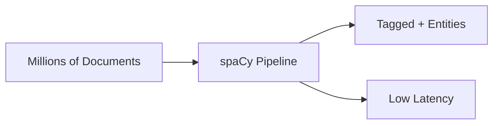
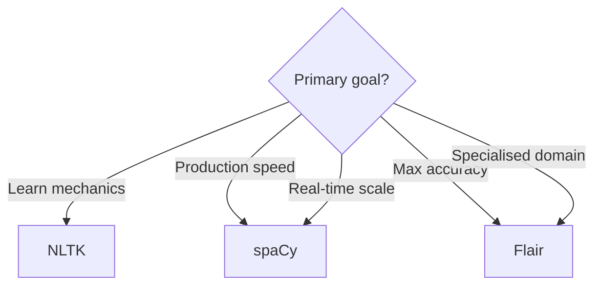

# Comparing NLTK, spaCy, and Flair for NLP Tasks

## Choosing the Right Tool

For POS tagging and NER, library selection depends on the project's **primary goal**:

| Goal | Recommended Library |
|------|---------------------|
| Learn NLP fundamentals | NLTK |
| Deploy fast production systems | spaCy |
| Maximise accuracy (compute available) | Flair |

Always match tool to task — no single library dominates all dimensions.

---

## Side-by-Side Comparison

| Dimension | NLTK | spaCy | Flair |
|-----------|------|-------|-------|
| **Primary use** | Education, research POC | Production, industry | Research, specialised domains |
| **Speed** | Slowest | **Fastest** | Moderate (slowest neural option) |
| **Accuracy** | Lower (classical ML) | High; ~1% below heaviest models | **Highest F1** on benchmarks |
| **Architecture** | Rule-based + classical ML | Transition-based shallow NN | BiLSTM-CRF + contextual embeddings |
| **Embeddings** | None (taggers use features) | Bloom embeddings (context-aware) | Flair embeddings (contextual strings) |
| **API complexity** | Manual multi-step pipeline | Streamlined single call | Load model → predict |
| **Visualisation** | Limited (tree plots) | **displaCy** built-in | Text output primarily |
| **Ease of use** | Manual steps | User-friendly | Simplest API (few lines) |

---

## NLTK: The Educator

**Methodology:** Modular pipeline — tokenise → POS tag → chunk for NER.

**Strengths:**
- Transparent step-by-step mechanics
- Excellent for teaching and small-scale experiments
- Rich corpora and linguistic resources

**Weaknesses:**
- Slower and less accurate on modern benchmarks
- NER limited entity types and span detection
- Not ideal for production microservices at scale

**Best for:** Coursework, POCs, understanding building blocks.

---

## spaCy: The Production Workhorse

**Methodology:** Efficient transition-based parser powered by shallow feed-forward neural networks and Bloom embeddings that capture word context.

**Strengths:**
- Fastest processing — critical for millions of documents or real-time streams
- Integrated POS, NER, dependency parsing in one pass
- displaCy for visual debugging and demos
- Industry-standard deployment path

**Weaknesses:**
- Slightly lower accuracy than heaviest deep models (often <1% F1 difference)

**Best for:** Production APIs, real-time tweet processing, document pipelines at scale.

---

## Flair: The Perfectionist

**Methodology:** BiLSTM-CRF with contextual string embeddings — deep understanding of word meaning from surrounding text. Handles polysemy well.

**Strengths:**
- State-of-the-art accuracy on standard benchmarks
- Strong on ambiguous and domain-specific text
- Simple high-level API

**Weaknesses:**
- Heavier model — slower inference
- Less ecosystem tooling than spaCy (visualisation, custom pipeline components)

**Best for:** Medical/legal NLP, research papers, offline batch where F1 is paramount.

---

## Decision Framework

**Example scenarios:**

- Process **millions of tweets in real time** → spaCy
- Squeeze **maximum accuracy** from critical medical records → Flair
- Build a **teaching demo** of NER pipeline steps → NLTK
- NLTK as **backup** when other libraries fail in constrained environments

---

## Common Pitfalls / Exam Traps

- Claiming **NLTK is obsolete** — still valuable for education and linguistics resources
- Assuming **Flair is always better** — speed penalty matters at scale
- Stating spaCy uses **deep transformers** for POS/NER — it uses transition-based shallow NNs (distinct from BERT)
- Confusing **Flair speed ranking** — Flair is slower than spaCy, not faster than NLTK in all cases (NLTK slowest overall)

---

## Quick Revision Summary

- NLTK: modular, educational, slowest, lowest accuracy — learn fundamentals
- spaCy: fastest, production-ready, displaCy, industry standard
- Flair: highest accuracy, BiLSTM-CRF, slower, best for specialised/research use
- Choose by goal: learn (NLTK), deploy (spaCy), accuracy (Flair)
- Real-time scale → spaCy; critical F1 → Flair; pipeline transparency → NLTK
