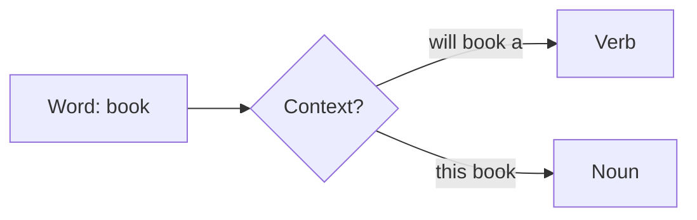

# Part-of-Speech Tagging: Assigning Grammatical Categories

## What Is POS Tagging?

Part-of-Speech (POS) tagging assigns a **grammatical category** to each token in a sentence — noun, verb, adjective, adverb, preposition, determiner, pronoun, and finer-grained subtypes.

**Example:** *"Natural language processing is fascinating."*

| Token | POS Tag | Category |
|-------|---------|----------|
| Natural | JJ | Adjective |
| language | NN | Noun |
| processing | NN | Noun |
| is | VBZ | Verb (present, 3rd person) |
| fascinating | JJ | Adjective |

POS tagging reveals **syntactic structure** — how words relate within a sentence.

---

## Why POS Tagging Matters

POS tags enable and improve:

- **Dependency parsing** — subject-verb-object relationships
- **Information extraction** — noun phrases as entity candidates
- **Text normalisation** — POS-aware lemmatisation
- **Question answering** — identifying wh-words and focus entities

Even transformer models learn implicit syntactic patterns; explicit POS tags remain interpretable and useful for hybrid pipelines.

---

## Context Sensitivity

POS tagging is **not** dictionary lookup — the same word receives different tags in different contexts:

| Sentence | *book* tag | Role |
|----------|-----------|------|
| "I will **book** a ticket." | VB (verb) | Action |
| "Read this **book**." | NN (noun) | Object |

Disambiguation requires surrounding context — a core challenge that modern taggers address with statistical or neural models.

---

## Tag Set Conventions

Different frameworks use different tag sets:

| Framework | Tag Set | Example Tags |
|-----------|---------|--------------|
| NLTK / Penn Treebank | Penn POS | NN, NNP, VBZ, DT, JJ |
| spaCy | Universal POS + fine-grained | NOUN, VERB, DET + `token.tag_` |
| Flair | Flair / OntoNotes-style | NNP, VBZ, DT |

Always consult the tag set documentation when interpreting output.

---

## Common Pitfalls / Exam Traps

- Treating POS as **fixed per word** — context determines tag
- Confusing **POS with NER** — *Apple* as NN (noun) vs ORG (organisation entity)
- Assuming **one tag set** across libraries — Penn tags ≠ Universal POS labels
- Ignoring POS when **lemmatising** — verb vs noun changes the lemma

---

## Quick Revision Summary

- POS tagging assigns grammatical categories to each token
- Reveals syntactic structure; supports parsing, IE, QA, and lemmatisation
- Highly context-sensitive — same word, different tags in different sentences
- Penn Treebank tags (NN, VBZ, DT) common in NLTK; spaCy adds Universal POS
- Not a dictionary lookup — requires contextual disambiguation
