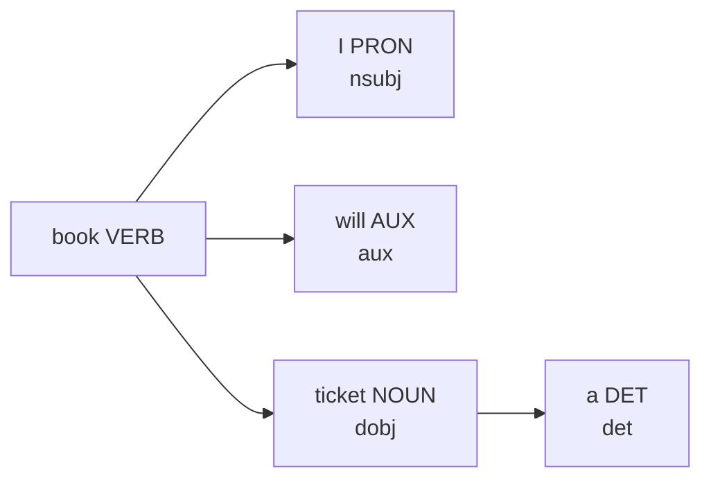

# Visualising POS Tags and Dependency Trees with spaCy

## Beyond Text Output

POS tags alone list grammatical categories. **Dependency parsing** adds syntactic relationships — which token modifies which, and what role each plays (subject, object, auxiliary).

spaCy's `displaCy` renders both POS tags and dependency arcs visually — invaluable for debugging pipelines and communicating NLP results.

---

## displaCy for POS Visualisation

```python
from spacy import displacy

doc = nlp("I will book a ticket.")
displacy.render(doc, style='dep', jupyter=True)
```

The dependency visualisation shows:

- **Tokens** with POS labels beneath each word
- **Directed arcs** linking head tokens to dependents
- **Relation labels** — nsubj (nominal subject), dobj (direct object), aux (auxiliary), det (determiner)

---

## Reading Dependency Relations

**Sentence:** *"I will book a ticket."*



| Relation | Meaning | Example |
|----------|---------|---------|
| nsubj | Nominal subject | I → book |
| aux | Auxiliary verb | will → book |
| dobj | Direct object | ticket → book |
| det | Determiner | a → ticket |

**Sentence:** *"Read this book."*

- *read* (VERB) — root
- *book* (NOUN) — dobj of *read*
- *this* (DET) — det of *book*

Same word *book* — noun in this sentence, verb in the previous example. Visualisation makes the contrast immediate.

---

## When Visualisation Helps

| Scenario | Benefit |
|----------|---------|
| Pipeline debugging | Spot wrong attachments quickly |
| Stakeholder demos | Non-technical audience grasps structure |
| Annotation QA | Verify parser output before training custom models |
| Teaching | Illustrate subject-verb-object patterns |

---

## Common Pitfalls / Exam Traps

- Using `style='ent'` for POS — use `style='dep'` for dependency/POS trees; `'ent'` is for NER
- Assuming **visualisation replaces evaluation** — pretty graphs don't guarantee correctness
- Ignoring **parse errors** on long or malformed sentences — visual check catches failures
- Confusing **dependency labels** (nsubj, dobj) with **POS tags** (NN, VB)

---

## Quick Revision Summary

- `displaCy.render(doc, style='dep')` visualises POS + dependency arcs
- Dependency relations: nsubj, aux, dobj, det link tokens syntactically
- Same word gets different structure in different sentences (*book* verb vs noun)
- Essential for debugging, demos, and understanding parser behaviour
- NER visualisation uses `style='ent'` — different from dependency view
