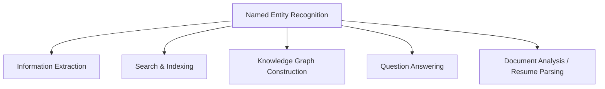

# Named Entity Recognition: Identifying Real-World Entities

## What Is NER?

Named Entity Recognition (NER) identifies and classifies **real-world entities** mentioned in text — mapping spans of tokens to predefined categories.

NER moves beyond syntax (POS) to **semantic meaning**: who, what organisation, where, when, and how much.

---

## Common Entity Types

| Label | Category | Examples |
|-------|----------|----------|
| **PERSON** | People (real or fictional) | Sundar Pichai, Alice |
| **ORG** | Organisations | Google, Apple, UN |
| **GPE / LOC** | Geopolitical entities / locations | India, UK, Washington |
| **DATE / TIME** | Temporal expressions | December 2026, Monday |
| **MONEY** | Monetary amounts | $1 billion, €500 |

**Example:** *"Sundar Pichai is the CEO of Google."*

| Span | Entity Type |
|------|-------------|
| Sundar Pichai | PERSON |
| Google | ORG |

---

## NER Applications

NER enables machines to answer **who did what, where, and when** — essential for enterprise search, compliance monitoring, and automated news aggregation.

---

## POS vs NER: Critical Distinction

| Aspect | POS Tagging | NER |
|--------|-------------|-----|
| Layer | Syntactic / grammatical | Semantic / real-world |
| Output | Noun, verb, adjective | PERSON, ORG, GPE, DATE |
| Example: *Apple* | NN (noun) | ORG (organisation) |

**Sentence:** *"Apple released a new product in India."*

- POS: *Apple* → noun
- NER: *Apple* → ORG; *India* → GPE

Same surface form, different annotation layers. NER often **builds on** POS and dependency information internally.

---

## NER Challenges

| Challenge | Example |
|-----------|---------|
| **Entity ambiguity** | *Washington* — person, location, or organisation? |
| **Boundary detection** | *Elon Musk* as one span vs two tokens |
| **Polysemy** | *Apple* — fruit (not ORG) vs company (ORG) |
| **Context dependence** | Domain-specific entity types |

NER is highly **context-dependent** — accuracy requires surrounding text, not isolated token lookup.

---

## Common Pitfalls / Exam Traps

- Equating **NN (noun)** with **named entity** — all entities are typically nouns, but not all nouns are entities
- Assuming **one-word entities only** — multi-token spans (*New York*, *Sundar Pichai*) are common
- Ignoring **entity type hierarchy** — GPE vs LOC vs FAC differ across tag sets
- Treating NER as **optional** in IE pipelines — it is often the primary extraction step

---

## Quick Revision Summary

- NER classifies text spans into entity types: PERSON, ORG, GPE, DATE, MONEY
- Semantic layer — distinct from grammatical POS tagging
- Powers IE, search, knowledge graphs, QA, document analysis
- Context-dependent; ambiguity (*Washington*, *Apple*) is a core challenge
- NER builds on syntactic analysis but answers different questions than POS
