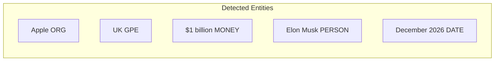

# Named Entity Recognition with spaCy

## spaCy as the Industry Standard for NER

spaCy provides production-grade NER integrated into its core pipeline. A single `nlp()` call returns entities accessible via `doc.ents` with labels, spans, and human-readable descriptions.

---

## Basic Implementation

```python
import spacy
nlp = spacy.load('en_core_web_sm')

text = "Apple is looking at buying a UK startup for $1 billion. Elon Musk said in December 2026."
doc = nlp(text)

for ent in doc.ents:
    print(ent.text, ent.label_, spacy.explain(ent.label_))
```

| Entity | Label | Description |
|--------|-------|-------------|
| Apple | ORG | Companies, agencies, institutions |
| UK | GPE | Countries, cities, states |
| $1 billion | MONEY | Monetary values |
| Elon Musk | PERSON | People, including fictional |
| December 2026 | DATE | Absolute or relative dates |

- `ent.text` — span text
- `ent.label_` — entity type string
- `spacy.explain(label)` — human-readable definition

---

## Visualisation with displaCy

```python
from spacy import displacy
displacy.render(doc, style='ent', jupyter=True)
```

Colour-coded entity spans render in Jupyter or browser — each entity type gets a distinct highlight.



---

## spaCy NER Strengths

| Strength | Detail |
|----------|--------|
| Accuracy | Strong on standard English news and web text |
| Speed | Fastest among NLTK, spaCy, Flair for large corpora |
| Integration | Same pipeline as POS and dependency parsing |
| Customisation | Train `EntityRuler` or fine-tune NER component |

---

## Real-World Deployment

- **Financial news monitoring** — extract ORG and MONEY from filings
- **CRM enrichment** — PERSON and ORG from email threads
- **Compliance scanning** — GPE and DATE in contract clauses

---

## Common Pitfalls / Exam Traps

- Accessing entities via **`doc.ents`** not `doc.entities`
- Forgetting **`ent.label_`** (string) vs `ent.label` (hash ID)
- Using **`style='dep'`** instead of **`style='ent'`** for NER visualisation
- Expecting perfect NER on **domain jargon** without custom training

---

## Quick Revision Summary

- spaCy NER: `doc = nlp(text)` → iterate `doc.ents`
- Labels: ORG, GPE, MONEY, PERSON, DATE + `spacy.explain()`
- Visualise: `displacy.render(doc, style='ent')`
- Industry default for production NER — fast and accurate
- Practise on varied text; consider custom models for specialised domains
