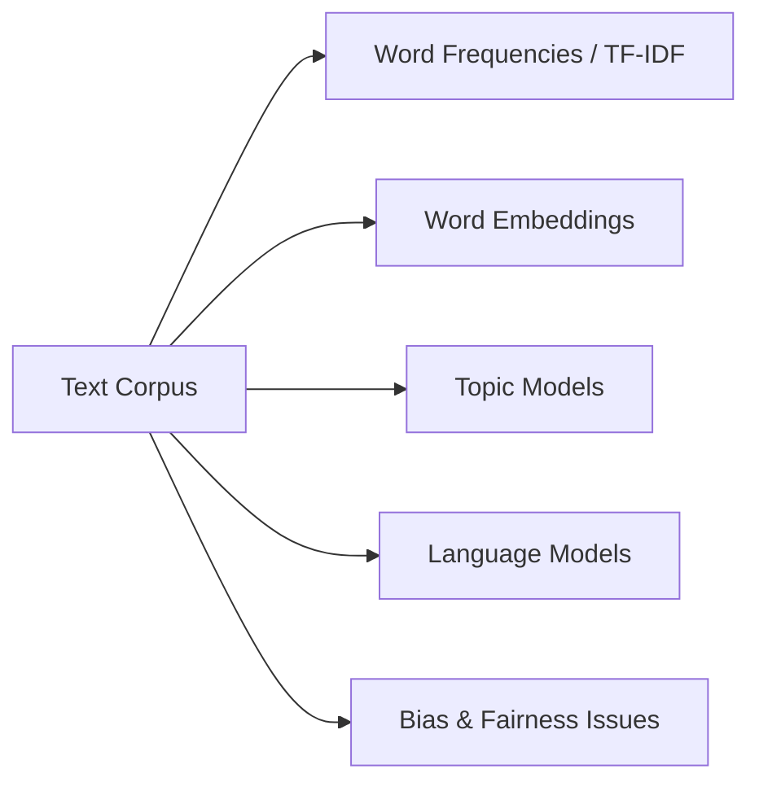

# Text Corpora and Corpus Linguistics: Module Overview

## Why Corpora Matter for NLP

Every NLP model learns from text data. The quality, composition, and bias of that data directly shape model behaviour — from word embeddings to large language models.

This module examines:

1. **What text corpora are** and how they differ from documents and datasets
2. **Types of corpora** — general-purpose, domain-specific, raw, annotated
3. **Bias and representation** — how human choices in data collection propagate into models
4. **Hands-on analysis** — exploring the Gutenberg and Brown corpora to discover statistical properties of language

---

## Key Insight: Garbage In, Garbage Out

Models do not understand language like humans — they learn **statistical patterns** from corpora. Change the corpus, change the model:

$$\text{Model behaviour} = f(\text{corpus statistics})$$

Understanding your data is as important as understanding your architecture.

---

## Module Lab Focus

| Corpus | Character | Analysis Goals |
|--------|-----------|----------------|
| **Gutenberg** | Literary classics | Vocabulary richness, word frequency, preprocessing effects |
| **Brown** | Balanced modern American English across genres | Cross-domain comparison, genre-specific language patterns |

Analysis reveals laws governing natural language — Zipfian word distributions, type-token ratios, and domain signatures in high-frequency terms.

---

## Common Pitfalls / Exam Traps

- Using **corpus**, **document**, and **dataset** interchangeably — each has a distinct definition
- Assuming **large corpus = good corpus** — representation and bias matter more than size alone
- Skipping **corpus exploration** before modelling — leads to silent failures in production

---

## Quick Revision Summary

- Module covers corpora foundations, types, bias, and hands-on Gutenberg/Brown analysis
- Models learn statistics from corpora — corpus quality determines model quality
- Gutenberg: literary; Brown: genre-balanced modern English
- Explore corpora before training — avoid treating text as a black box
- Bias in data propagates to bias in predictions
