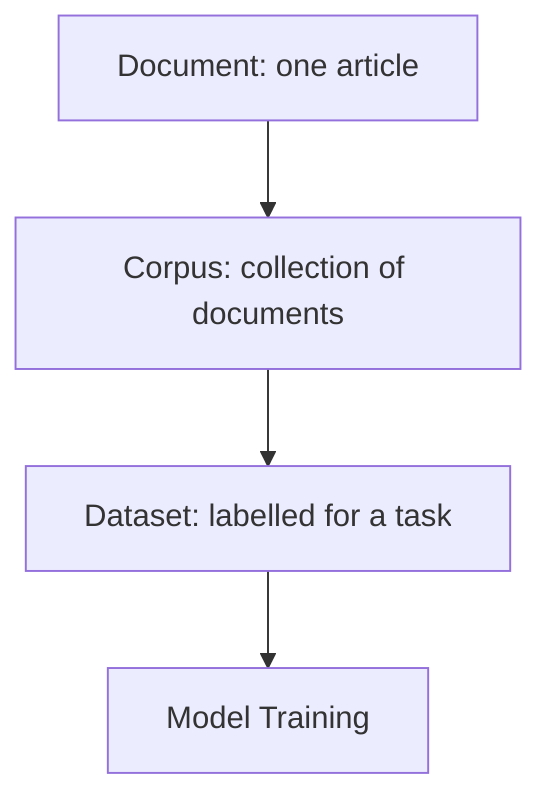

# What Is a Text Corpus and Why It Matters

## Defining a Text Corpus

A **text corpus** (plural: corpora) is a large, structured collection of text assembled to study, analyse, and model language. It is more than a single document or an unorganised folder of files — it is **carefully collected** to represent language usage for a purpose.

---

## Corpus vs Document vs Dataset

| Term | Definition | Example |
|------|------------|---------|
| **Document** | Single unit of text | One book, article, or review |
| **Corpus** | Collection of documents | 500 books; 1 million reviews |
| **Dataset** | Corpus organised for a specific task, often with labels | IMDb sentiment dataset; SQuAD QA pairs |

**Key distinction:** Corpora provide **language**; datasets provide **supervision** (labels for training/evaluation).

---

## Examples of Text Corpora

| Corpus Type | Example | Typical Use |
|-------------|---------|-------------|
| Literary collection | Gutenberg corpus | Language modelling, literary NLP |
| News across categories | Brown corpus | Genre analysis, POS research |
| Labelled reviews | Movie sentiment corpus | Sentiment classification |
| QA pairs | SQuAD | Question answering |

When we say "train an NLP model," we mean train on a **text corpus** (or labelled dataset derived from one).

---

## Why Corpora Drive Everything in NLP

Machines process zeros and ones — they learn **patterns, statistics, and distributions** from text:

| NLP Technique | Corpus Dependency |
|---------------|-------------------|
| TF-IDF | Word frequencies across documents |
| Word embeddings | Word co-occurrence patterns |
| Topic models (LDA) | Document-word distributions |
| Language models | Sequential token patterns |

$$\text{TF-IDF}(t, d) \propto \text{count}(t \text{ in } d) \times \log\frac{N}{\text{df}(t)}$$

All statistics originate from the corpus. **Any change in corpus changes model behaviour.**

---

## Language Is Statistical, Not Rule-Based

Traditional linguistics emphasises grammatical rules. Modern NLP emphasises **usage patterns**:

- *Bank* disambiguates via co-occurrence (*river bank* vs *investment bank*), not explicit rules
- Frequency and context from the corpus drive meaning — not a hand-crafted lexicon

**Principle:** Garbage corpus → garbage model (GIGO).

---

## Common Pitfalls / Exam Traps

- Calling a **single PDF** a corpus — a corpus requires multiple documents
- Confusing **corpus** (raw language) with **dataset** (task-specific labels)
- Assuming models **understand** language — they reproduce corpus statistics
- Ignoring that **TF-IDF, embeddings, and LMs** all derive statistics from the same underlying text

---

## Quick Revision Summary

- Corpus = large, structured text collection for language study and modelling
- Document < Corpus < Dataset (with labels for tasks)
- Corpora provide language; datasets provide supervision
- TF-IDF, embeddings, topic models, LMs all depend on corpus statistics
- Language learning in NLP is statistical — GIGO applies
