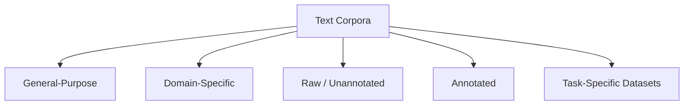

# Types of Text Corpora

## Why Classify Corpora?

Not all text corpora serve the same purpose. Genre, annotation level, and domain determine which corpus fits which NLP task. Choosing wrongly leads to **poor generalisation** and misinterpreted model outputs.

News language differs from conversational text; literary prose differs from product reviews; raw text differs from labelled annotations.

---

## Taxonomy Overview

---

## 1. General-Purpose Corpora

Designed to represent **broad language usage** across genres and styles.

| Corpus | Composition | Strengths |
|--------|-------------|-----------|
| **Brown** | Balanced across news, fiction, reviews, etc. | Diverse vocabulary; multiple writing styles |
| **Gutenberg** | Literary classics and books | Rich vocabulary; long-form narrative |

**Limitation:** Poor performance on specialised domains (finance, healthcare, legal) without fine-tuning or domain corpora.

---

## 2. Domain-Specific Corpora

Focused on a **particular field or application**.

| Domain | Corpus Example | Task |
|--------|----------------|------|
| Sentiment | Movie reviews (IMDb) | Sentiment classification |
| Clinical | Medical reports | Clinical NLP |
| Legal | Contracts, case law | Contract analysis |

**Properties:** Specialised terminology, narrow context, high task relevance.

**Critical rule:** A sentiment model trained on movie reviews **will not** perform well on medical text.

---

## 3. Raw (Unannotated) Corpora

Plain text with **no linguistic or task labels**.

| Examples | Use Cases |
|----------|-----------|
| Gutenberg books | Language modelling |
| Wikipedia dumps | Word embeddings, topic modelling |

Suited for **unsupervised** methods that learn from co-occurrence and distribution alone.

---

## 4. Annotated Corpora

Enriched with **linguistic or task-specific labels**:

- POS tags
- Named entities
- Sentiment labels (positive / negative / neutral)
- Syntactic dependencies

| Examples | Use |
|----------|-----|
| POS-tagged Brown corpus | Supervised tagging evaluation |
| CoNLL NER datasets | NER training and benchmarking |

Used for **supervised learning** and **evaluation**.

---

## 5. Task-Specific Datasets

Corpora created for a **defined input-output task**:

| Task | Dataset |
|------|---------|
| Sentiment analysis | IMDb reviews |
| Question answering | SQuAD |
| Text classification | AG News, etc. |

**Properties:** Clear input-output pairs, high-quality labels, ideal for training and comparison.

**Limitation:** Narrow task scope; limited linguistic diversity beyond the task.

---

## Comparison Table

| Type | Labels | Diversity | Best For |
|------|--------|-----------|----------|
| General-purpose | Usually none | High | Foundational NLP, exploration |
| Domain-specific | Varies | Low (within domain) | Specialised applications |
| Raw | None | Varies | LM, embeddings, topic modelling |
| Annotated | Linguistic | Medium | Supervised tagging, NER |
| Task-specific | Task labels | Low | Model training, benchmarks |

---

## Common Pitfalls / Exam Traps

- Training a **medical NER model** on Gutenberg literary text
- Using **task-specific datasets** for general language modelling — too narrow
- Assuming **annotated corpora** are always large — many are small but high-quality
- Confusing **Gutenberg as general-purpose** — it skews heavily literary/archaic

---

## Quick Revision Summary

- Five corpus types: general-purpose, domain-specific, raw, annotated, task-specific
- Brown = balanced genres; Gutenberg = literary classics
- Domain corpora essential for finance, health, legal NLP
- Raw corpora for unsupervised methods; annotated for supervised tagging/NER
- Match corpus type to task — wrong corpus → poor generalisation
