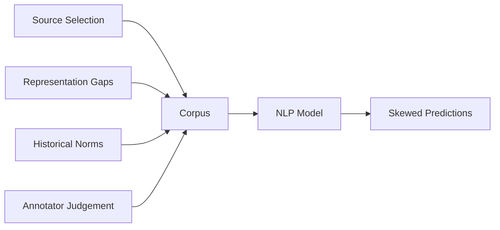

# Bias and Representation in Text Corpora

## Corpora Are Not Neutral

A text corpus is written by humans, selected by humans, and collected from specific sources. It naturally reflects:

- Social norms of the source community
- Cultural assumptions
- Historical inequalities

NLP models learn **directly** from corpora — they do not invent bias; they **absorb** it from training data.

$$\text{Model bias} \leftarrow \text{Corpus bias}$$

Bias is a **data problem before it is a model problem.**

---

## Types of Corpus Bias

| Bias Type | Description | Example |
|-----------|-------------|---------|
| **Source bias** | Each source has its own lens | News vs social media vs academic text |
| **Representation bias** | Who appears, how often | Under-represented demographics; absent dialects |
| **Historical bias** | Old texts reflect past norms | Outdated terminology; stereotypical role language |
| **Annotation bias** | Human labelers inject subjectivity | Ambiguous cases simplified; cultural framing in labels |

---

## How Bias Manifests in Models

| Manifestation | Example |
|---------------|---------|
| Skewed predictions | Model performs worse on under-represented groups |
| Stereotypes in embeddings | *doctor* closer to *man*; *nurse* closer to *woman* |
| Unequal performance | Higher error rates on dialects absent from training data |

Word embeddings capture **historical co-occurrence patterns** from text — models optimise statistical regularities, not fairness.

This is not a bug in the algorithm alone; it reflects **patterns in the corpus**.

---

## Pre-Deployment Checklist

Before training or deploying any NLP model, ask:

1. **Where does this corpus come from?** (Source, time period, collection method)
2. **Who does it represent well?** (Demographics, domains, languages)
3. **Who might it miss?** (Minority dialects, non-Western contexts, rare entities)

Understanding data is as important as understanding model architecture.

---

## Mitigation Strategies (Conceptual)

| Strategy | Action |
|----------|--------|
| Audit | Explore corpus demographics and term frequencies |
| Diversify | Combine multiple sources to balance representation |
| Evaluate per group | Measure performance across subpopulations |
| De-bias embeddings | Post-processing or adversarial training (advanced) |

---

## Common Pitfalls / Exam Traps

- Claiming **"the model is biased"** without examining **training data** first
- Assuming **larger corpora eliminate bias** — scale can amplify dominant viewpoints
- Ignoring **annotation bias** in supervised datasets — labels carry human judgement
- Treating **historical text** as representative of current social norms

---

## Quick Revision Summary

- Corpora reflect human choices — not neutral ground truth
- Bias types: source, representation, historical, annotation
- Models absorb corpus bias → skewed predictions and stereotyped embeddings
- Ask: where from, who represented, who missed — before deployment
- Bias is a data problem first; understanding corpus > blaming model alone
