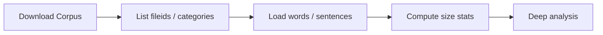

# Corpus Exploration Setup with NLTK

## Why Explore a Corpus Before Modelling?

Corpus analysis reveals what data is actually available — structure, size, tokenisation, and genre composition. Skipping exploration treats text as a **black box**, hiding vocabulary gaps, preprocessing needs, and domain mismatch until models fail silently in production.

Exploration answers:
- How many documents and tokens exist?
- Is text pre-tokenised or raw?
- What genres or authors are represented?

---

## NLTK Setup for Classic Corpora

```python
import nltk
from nltk.corpus import gutenberg, brown

nltk.download('gutenberg')
nltk.download('brown')
```

---

## Gutenberg Corpus Overview

The Gutenberg corpus contains **literary classics** — novels, poetry, and historical texts.

```python
gutenberg.fileids()
# ['austen-emma.txt', 'austen-persuasion.txt', 'blake-poems.txt',
#  'bryant-stories.txt', 'shakespeare-hamlet.txt', ...]
```

Each file ID corresponds to one classic work.

### Inspecting a Single Book

```python
words = gutenberg.words('carroll-alice.txt')
sents = gutenberg.sents('carroll-alice.txt')

len(words)   # e.g., 34,110 tokens
len(sents)   # e.g., 1,703 sentences
```

NLTK provides **pre-tokenised** words and sentences — ready for frequency analysis without manual tokenisation.

---

## Brown Corpus Preview

The Brown corpus represents **modern American English** balanced across multiple genres (news, fiction, religion, etc.). Deep analysis follows in a dedicated note; here we confirm availability:

```python
brown.categories()
# ['adventure', 'belles_lettres', 'editorial', 'fiction', 'government',
#  'hobbies', 'humor', 'learned', 'lore', 'mystery', 'news', ...]
```

---

## Exploration Workflow



| Step | Function | Output |
|------|----------|--------|
| List contents | `gutenberg.fileids()` | Available works |
| Word tokens | `gutenberg.words(fileid)` | Token list |
| Sentences | `gutenberg.sents(fileid)` | Sentence list |
| Categories | `brown.categories()` | Genre labels |

---

## Key Observation

Pre-tokenised NLTK corpora include **punctuation and capitalisation** from original texts. Raw counts differ from cleaned counts — always document whether statistics apply to raw or preprocessed text.

---

## Common Pitfalls / Exam Traps

- Forgetting **`nltk.download()`** before accessing corpora
- Confusing **word count** with **unique vocabulary size**
- Assuming pre-tokenised text is **clean** — punctuation and caps remain
- Using **Gutenberg statistics** to characterise modern web language

---

## Quick Revision Summary

- Explore corpora before modelling — avoid black-box assumptions
- NLTK: `gutenberg` and `brown` with `nltk.download()`
- Gutenberg: literary classics; `words()` and `sents()` pre-tokenised
- Brown: genre-balanced modern American English
- Raw corpus tokens include punctuation and capitalisation
