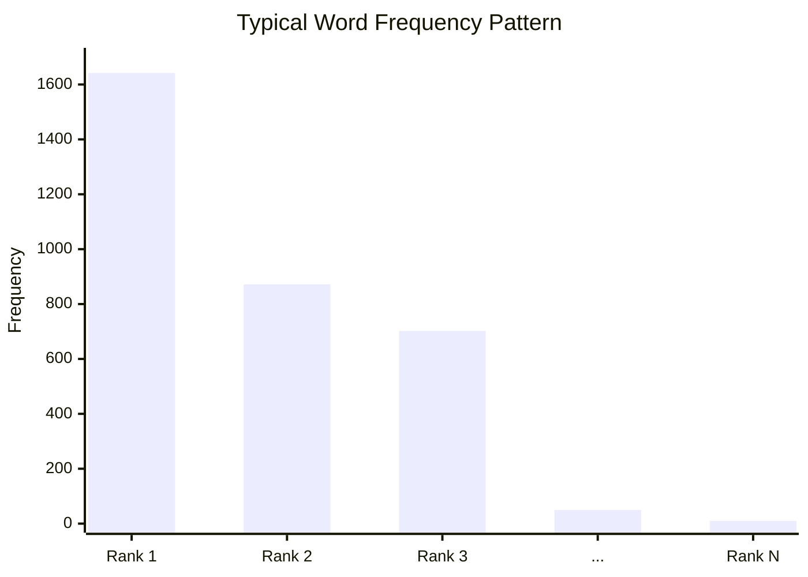

# Gutenberg Corpus Analysis: Vocabulary and Word Frequency

## Analysis Objectives

Using a single literary text (*Alice's Adventures in Wonderland*), this analysis explores:

- Corpus size (tokens and sentences)
- Effect of preprocessing on counts
- Vocabulary richness (type-token ratio)
- Word frequency distributions
- Content words after stopword removal

---

## Loading and Raw Inspection

```python
from nltk.corpus import gutenberg

fileid = 'carroll-alice.txt'
words = gutenberg.words(fileid)
sents = gutenberg.sents(fileid)

len(words)  # 34,110 total tokens
len(sents)  # 1,703 sentences
```

Raw tokens preserve **original capitalisation and punctuation** — reflecting the source text, not model-ready form.

---

## Preprocessing for Analysis

Normalise for statistical analysis (distinct from modelling preprocessing):

```python
clean_words = [w.lower() for w in words if w.isalpha()]
len(clean_words)  # 27,333 (down from 34,110)
```

| Effect | Impact |
|--------|--------|
| Lowercasing | Reduces vocabulary inflation (*The* vs *the*) |
| `isalpha()` filter | Removes punctuation tokens and numbers |

---

## Vocabulary Richness

```python
vocab = set(clean_words)
len(vocab)  # 2,569 unique words (types)
```

**Type-Token Ratio (TTR):**

$$\text{TTR} = \frac{|\text{types}|}{|\text{tokens}|} = \frac{2569}{27333} \approx 0.094$$

TTR measures **lexical diversity** — higher values suggest richer vocabulary relative to text length. Literary texts often show higher TTR than repetitive genres.

TTR provides **intuition**, not absolute judgement — compare within similar text lengths and genres.

---

## Word Frequency Distribution

```python
from collections import Counter
freq = Counter(clean_words)
freq.most_common(10)
# [('the', 1642), ('to', 872), ('and', 702), ...]
```

Top tokens are **function words** (stopwords) — low semantic content, high frequency.

After stopword removal:

```python
from nltk.corpus import stopwords
stops = set(stopwords.words('english'))
content_words = [w for w in clean_words if w not in stops]
Counter(content_words).most_common(10)
# [('said', ...), ('alice', ...), ('queen', ...), ...]
```

Content words reveal **thematic signals** — character names, plot vocabulary — useful for topic modelling, summarisation, and sentiment analysis.

---

## Zipfian Distribution Pattern



Few words dominate (head); a long tail of rare words follows. This **power-law** pattern appears across virtually all natural language corpora.

---

## Visualisation

Matplotlib bar charts of `freq.most_common(20)` for raw vs stopword-filtered distributions make the shift from function words to content words visually clear.

---

## Common Pitfalls / Exam Traps

- Reporting **raw token count** without noting punctuation inclusion
- Confusing **types** (unique words) with **tokens** (total count)
- Using TTR to compare **texts of very different lengths** without normalisation
- Assuming stopword removal is appropriate for **all downstream tasks**

---

## Quick Revision Summary

- Gutenberg *Alice*: ~34K raw tokens → ~27K alphabetic lowercase tokens
- Vocabulary: 2,569 unique types; TTR ≈ 0.094 (lexical diversity measure)
- Raw freq dominated by *the*, *to*, *and*; content words emerge after stopword removal
- Few words dominate; long tail of rare words (Zipfian pattern)
- Preprocessing for analysis ≠ preprocessing for modelling — document which applies
