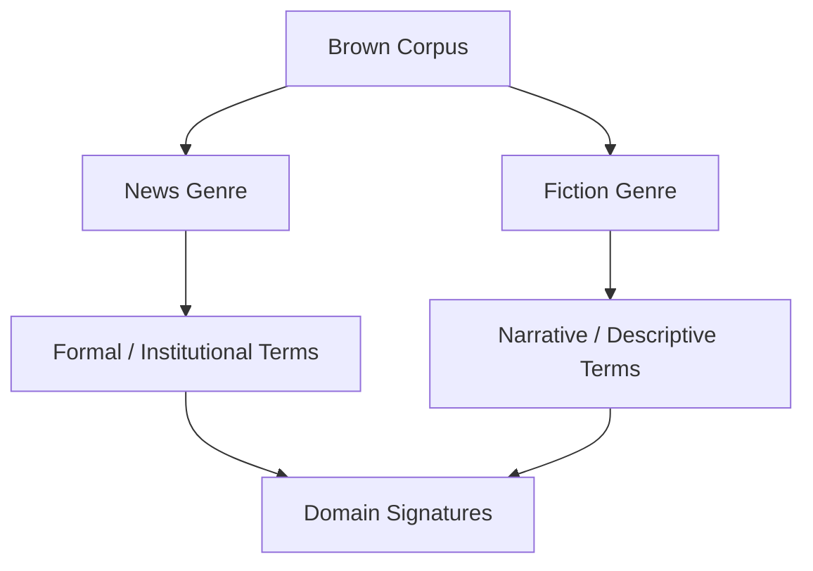

# Brown Corpus Analysis: Cross-Genre Language Comparison

## Why the Brown Corpus?

The Brown corpus differs fundamentally from Gutenberg:

| Aspect | Gutenberg | Brown |
|--------|-----------|-------|
| Era | Classic literature | Modern American English |
| Composition | Single-author books | Balanced across genres |
| Purpose | Literary language study | Representative language usage |
| Design | Author/style-specific | Multi-genre sampling |

Brown enables **quantitative comparison** of how language varies across domains.

---

## Exploring Categories

```python
from nltk.corpus import brown

brown.categories()
# ['adventure', 'belles_lettres', 'editorial', 'fiction', 'government',
#  'hobbies', 'humor', 'learned', 'lore', 'mystery', 'news', 'religion',
#  'reviews', 'romance', 'science_fiction', ...]

len(brown.words())  # ~1,161,192 total tokens (entire corpus)
```

Each category represents a **genre** of English — news, fiction, government prose, etc.

---

## Comparing Genre Sizes

```python
news_words = brown.words(categories='news')
fiction_words = brown.words(categories='fiction')

len(news_words)    # e.g., ~46,000+ tokens (varies by preprocessing)
len(fiction_words) # e.g., ~68,000+ tokens
```

Token count alone does not explain lexical richness — compare vocabulary metrics next.

---

## Vocabulary Metrics by Genre

Preprocess: keep alphabetic tokens only.

```python
def preprocess(words):
    return [w.lower() for w in words if w.isalpha()]

news_clean = preprocess(news_words)
fiction_clean = preprocess(fiction_words)

news_vocab = set(news_clean)
fiction_vocab = set(fiction_clean)

news_ttr = len(news_vocab) / len(news_clean)
fiction_ttr = len(fiction_vocab) / len(fiction_clean)
```

**Example observations:**

| Genre | Tokens (clean) | Unique types | TTR |
|-------|----------------|--------------|-----|
| News | ~11,151 | ~1,488 | ~0.133 |
| Fiction | ~8,141 | ~1,161 | ~0.143 |

Fiction often shows **higher lexical diversity** (TTR) despite fewer total tokens. News language is more **standardised and repetitive** — institutional terms recur (*said*, *county*, *jury*).

---

## Frequency Analysis with Stopwords

```python
from collections import Counter
from nltk.corpus import stopwords

stops = set(stopwords.words('english'))

def top_content_words(words, n=10):
    filtered = [w for w in words if w not in stops]
    return Counter(filtered).most_common(n)
```

| Genre | Top content words (examples) |
|-------|------------------------------|
| News | *fulton*, *county*, *grand*, *jury*, *investigation*, *said* |
| Fiction | *would*, *said*, *one*, *could*, *like*, *man*, *back* |

News exhibits **institutional/formal** vocabulary; fiction uses **narrative/descriptive** terms — clear **domain signatures**.

---

## Custom Stopwords

Domain-specific high-frequency words may lack semantic value:

```python
stops.add('said')  # common in news but uninformative for topic analysis
```

Custom stopword lists improve task-specific analysis — *said* disappears from top-N lists after addition.

---

## Visualisation

Matplotlib bar charts comparing `most_common(20)` for news vs fiction (after stopword removal) with rotated x-labels (`plt.xticks(rotation=45)`) reveal genre-specific frequency profiles.



---

## Key Observations

1. **Same language, different statistics** — English words behave differently by genre
2. **High-frequency words are domain-specific** after stopword removal
3. **TTR and token counts** must be interpreted together — not in isolation
4. **Custom stopwords** refine analysis for specific use cases

---

## Common Pitfalls / Exam Traps

- Comparing **raw token counts** without alphabetic preprocessing
- Assuming **higher token count = richer vocabulary** — TTR may disagree
- Using **default stopwords only** — domain terms like *said* in news may need custom removal
- Generalising **Brown (American English, 1960s)** to all modern English web text

---

## Quick Revision Summary

- Brown: ~1.16M tokens, balanced across 15+ genres of modern American English
- News vs fiction: different token counts, TTR, and content-word profiles
- News → institutional terms; fiction → narrative vocabulary
- TTR: fiction often higher lexical diversity; news more repetitive
- Custom stopwords refine genre analysis; visualise with frequency bar charts
