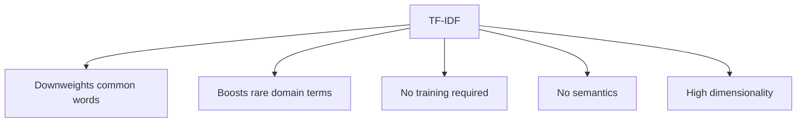

# Advantages and Limitations of TF-IDF

## Intuition: The Best Sparse Representation

TF-IDF is often the strongest sparse vectorization method — it improves on BoW without requiring neural network training. But it inherits fundamental limitations of all count-based methods. Understanding where TF-IDF stops is as important as knowing where it shines.

---

## Advantages

### 1. Automatic Stopword Downweighting

Common words (`the`, `is`, `and`, `of`) appear in nearly every document, so their IDF approaches zero. TF-IDF reduces their influence without an explicit stopword removal step.

| Word | Typical IDF Behavior |
|------|-------------------|
| `the` | Near 0 — appears everywhere |
| `mitochondria` | High — appears in few biology documents |
| `refund` | Moderate-high — domain-specific to support tickets |

### 2. Domain-Specific Term Emphasis

Rare but meaningful terms receive high weights. In a biology paper corpus, `mitochondria` scores far higher than `cell` (common even within the domain) or `the` (common everywhere).

### 3. Strong Baseline for Classification and Retrieval

TF-IDF + linear SVM or logistic regression remains competitive for:
- News categorization
- Email routing in enterprise helpdesk systems
- Patent or legal document classification on cloud ML platforms

### 4. Efficient and Interpretable

No GPU training, no epochs. Each feature is a word with a float weight — explainable via top-weighted terms per document.

---

## Limitations

### 1. No Semantic Meaning

"Car" and "automobile" remain orthogonal features. "Happy" and "joyful" have no structural relationship. The model must discover synonymy from label co-occurrence alone.

### 2. High Dimensionality

Vocabulary size equals feature count. A 100,000-term vocabulary produces 100,000-dimensional vectors. Sparse storage mitigates memory, but compute for dense operations remains costly.

### 3. No Word Order

Like BoW, TF-IDF discards sequence. "Not good" and "good" share the feature `good` unless n-grams are added.

### 4. Cold Start for New Vocabulary

Words not seen during `fit` are silently dropped at `transform` time. Rapidly evolving domains (social media, product catalogs) require periodic vocabulary refresh.

### 5. Sensitive to Corpus Composition

IDF values depend entirely on the training corpus. A term rare in one corpus may be common in another — TF-IDF weights are not transferable across domains without refitting.

---

## Comparison Table: All Sparse Methods

| Property | OHE | BoW | TF-IDF |
|----------|-----|-----|--------|
| Values | 0/1 | Integers | Floats |
| Frequency | No | Yes | Yes (weighted) |
| Stopword handling | Manual | Manual | Automatic (partial) |
| Semantics | No | No | No |
| Best use case | Small categorical vocab | Keyword tasks | Classification, retrieval |

---

## When to Move Beyond TF-IDF

Upgrade to dense or contextual embeddings when:

- Synonymy and paraphrase matter (semantic search)
- Word order and negation are critical (sentiment, NLI)
- Transfer learning from large pretrained models is available (BERT, sentence-transformers)

---

## Common Pitfalls / Exam Traps

- **"TF-IDF captures semantics"** — false. It captures statistical importance, not meaning.
- **"Stopword removal is unnecessary with TF-IDF"** — mostly true but not absolute; explicit removal can still improve results.
- **Confusing TF-IDF with Word2Vec** — TF-IDF is sparse and count-based; Word2Vec is dense and learned.
- **Exam trap: TF-IDF still has high dimensionality** — yes, vocabulary-sized vectors remain.

---

## Quick Revision Summary

- TF-IDF advantages: auto-downweights common words, boosts domain terms, no training, strong classification baseline.
- TF-IDF limitations: no semantics, high dimensionality, no word order, corpus-dependent IDF.
- `mitochondria` scores high in biology corpora; `the` scores near zero.
- TF-IDF is the strongest sparse method but still treats words as independent features.
- N-grams can partially recover word order within TF-IDF pipelines.
- Dense embeddings (Word2Vec, BERT) address the semantic gap TF-IDF cannot close.
