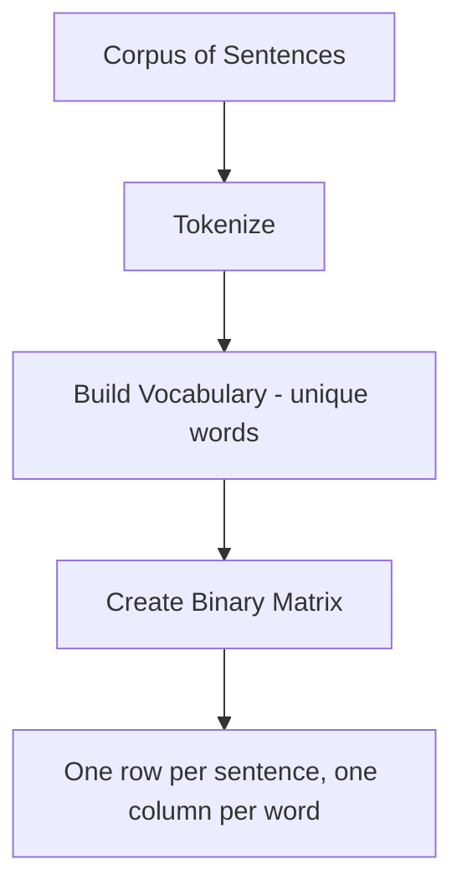

# One-Hot Encoding for Text

## Intuition: Words as Categories

One-hot encoding (OHE) is the simplest way to represent text numerically. It treats every unique word in a **vocabulary** as an isolated category — much like encoding a color field with values `red`, `blue`, `green` in a tabular dataset.

The key idea: a word is either present in a document (1) or absent (0). No partial credit, no frequency count, no semantic relationship between words.

---

## Building a Vocabulary

Given a corpus of documents, extract every **unique** word across all sentences. This collection is the **vocabulary**.

**Example corpus:**

| Sentence |
|----------|
| I love NLP |
| I love AI |
| NLP is the future |

**Vocabulary** (unique words): `AI`, `I`, `NLP`, `future`, `is`, `love` — six words total.

---

## Constructing the One-Hot Matrix

Each sentence becomes a row; each vocabulary word becomes a column. Cell values indicate whether that word appears in that sentence (1 = present, 0 = absent).

| Sentence | AI | I | NLP | future | is | love |
|----------|----|---|-----|--------|----|------|
| I love NLP | 0 | 1 | 1 | 0 | 0 | 1 |
| I love AI | 1 | 1 | 0 | 0 | 0 | 1 |
| NLP is the future | 0 | 0 | 1 | 1 | 1 | 0 |

Notice:
- "I love NLP" and "I love AI" share three active dimensions (`I`, `love`, and either `NLP` or `AI`).
- Repeated words within a sentence still register as 1 — OHE does not count frequency.

---

## Mathematical Form

For vocabulary size $|V|$ and document $d$, the one-hot vector $\mathbf{x}_d \in \{0, 1\}^{|V|}$ satisfies:

$$x_i = \begin{cases} 1 & \text{if word } w_i \text{ appears in } d \\ 0 & \text{otherwise} \end{cases}$$

At most $|V|$ entries can be 1 per sentence (fewer if the sentence is shorter than the vocabulary).

---

## When OHE Makes Sense

OHE works well when:

- The vocabulary is **small** (dozens to low hundreds of words)
- Only **presence** matters, not frequency or order
- Interpretability is valued — each dimension has a clear label

In cloud ML contexts, OHE appears in feature stores for categorical fields (e.g., product category tags in a recommendation pipeline) and as a baseline text representation before investing in embedding infrastructure.

---

## Common Pitfalls / Exam Traps

- **Confusing OHE with BoW** — OHE marks presence (0/1); BoW counts frequency (0, 1, 2, …). "I love love" would be `[0,1,0,0,0,2]` in BoW but `[0,1,0,0,0,1]` in OHE.
- **Forgetting vocabulary ordering** — columns must stay in a consistent order across all documents; shuffling vocabulary indices breaks the representation.
- **Assuming OHE captures word importance** — common words and rare words receive equal weight if both appear once.
- **Exam trap: "OHE preserves word order"** — it does not. "dog bites man" and "man bites dog" produce identical vectors.

---

## Quick Revision Summary

- One-hot encoding represents each word as a binary indicator in a fixed-size vocabulary vector.
- Vocabulary = set of all unique words in the corpus.
- Each sentence becomes a row of 0s and 1s — 1 where the word is present, 0 otherwise.
- OHE is the simplest vectorization method but ignores frequency, order, and semantics.
- Works best for small vocabularies and presence-only tasks.
- Distinct from BoW (which counts) and TF-IDF (which weights by rarity).
