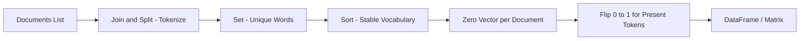

# Implementing One-Hot Encoding in Python

## Intuition: From Concept to Code

Understanding the matrix on paper is one step; implementing it reveals the pipeline every NLP system follows: **tokenize → build vocabulary → encode**. Manual implementation clarifies what libraries like scikit-learn's `CountVectorizer` automate under the hood.

---

## Pipeline Overview



---

## Step 1: Prepare the Corpus

```python
documents = [
    "I love NLP",
    "I love AI",
    "NLP is the future"
]
```

---

## Step 2: Build the Vocabulary

Join all sentences, split on whitespace, deduplicate with a set, then sort for reproducibility:

```python
vocab = sorted(set(" ".join(documents).split()))
# ['AI', 'I', 'NLP', 'future', 'is', 'love']
```

| Operation | Purpose |
|-----------|---------|
| `" ".join(documents)` | Flatten corpus into one string |
| `.split()` | Tokenize on whitespace |
| `set(...)` | Remove duplicates |
| `sorted(...)` | Deterministic column order |

---

## Step 3: Encode Each Document

For each document:
1. Tokenize the sentence
2. Create a zero vector of length `len(vocab)`
3. For each token present in the vocabulary, set the corresponding index to 1
4. Append the vector to the result list

```python
one_hot_vectors = []
for doc in documents:
    tokens = doc.split()
    vector = [0] * len(vocab)
    for token in tokens:
        if token in vocab:
            vector[vocab.index(token)] = 1
    one_hot_vectors.append(vector)
```

**Result:**

| Sentence | Vector |
|----------|--------|
| I love NLP | `[0, 1, 1, 0, 0, 1]` |
| I love AI | `[1, 1, 0, 0, 0, 1]` |
| NLP is the future | `[0, 0, 1, 1, 1, 0]` |

---

## Step 4: Display as a DataFrame

```python
import pandas as pd

df = pd.DataFrame(one_hot_vectors, columns=vocab, index=documents)
```

The DataFrame makes the matrix human-readable: rows are sentences, columns are vocabulary words, values are 0 or 1.

---

## Production Alternatives

| Tool | Class | Notes |
|------|-------|-------|
| scikit-learn | `CountVectorizer(binary=True)` | `binary=True` enforces 0/1 instead of counts |
| pandas | `pd.get_dummies()` | Works for token-level, not document-level |
| Keras | `keras.utils.to_categorical()` | Common for label encoding, adaptable for tokens |

For large-scale pipelines (e.g., AWS SageMaker feature engineering), pre-built vectorizers handle out-of-vocabulary words, n-grams, and sparse matrix storage automatically.

---

## Common Pitfalls / Exam Traps

- **Case sensitivity** — `"NLP"` and `"nlp"` are different tokens unless lowercased during preprocessing.
- **Using `list.index()` in a loop** — works for demos but is $O(n)$ per lookup; production code uses a `dict` mapping word → index.
- **Forgetting to sort the vocabulary** — without `sorted()`, set iteration order is non-deterministic across Python runs.
- **Exam trap: "join then split equals original tokens"** — only true for space-separated tokens; punctuation attached to words (`"NLP."`) becomes a separate token.

---

## Quick Revision Summary

- OHE implementation: tokenize corpus → build sorted vocabulary → create zero vectors → set 1 for present tokens.
- `set()` removes duplicates; `sorted()` ensures reproducible column order.
- Output is a list of lists (or sparse matrix) with one row per document.
- Pandas DataFrame aids visualization with sentences as index and words as columns.
- Production systems use `CountVectorizer(binary=True)` or equivalent for efficiency.
- Case handling and tokenization strategy must be decided before vocabulary construction.
