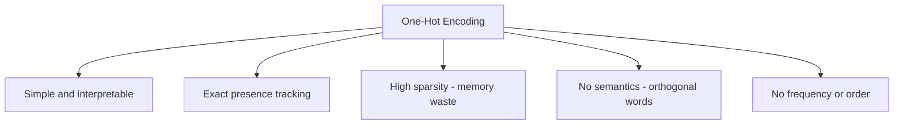

# Advantages and Limitations of One-Hot Encoding

## Intuition: Know When to Use a Tool

One-hot encoding is the "Hello World" of text vectorization. Its strengths are transparency and simplicity; its weaknesses become critical at scale. Choosing OHE without understanding these trade-offs leads to wasted memory, poor model performance, and false confidence in semantic understanding.

---

## Advantages

| Advantage | Explanation |
|-----------|-------------|
| **Simplicity** | Easy to understand, implement, and debug — no training required |
| **No information loss on presence** | If a word appears, it is recorded exactly; nothing is averaged or compressed away |
| **Interpretability** | Each dimension maps to a known word; feature importance is directly readable |
| **No training data dependency** | Vocabulary is built from any corpus instantly — no GPU, no epochs |

In practice, OHE suits **small, controlled vocabularies**: intent labels in a chatbot router, product SKU categories in an e-commerce classifier, or keyword flags in a rule-augmented ML pipeline.

---

## Limitations

### 1. Extreme Sparsity

For a vocabulary of 10,000 words, each sentence vector has at most a handful of 1s and **9,995+ zeros**. This wastes memory and slows computation.

$$\text{Sparsity ratio} \approx 1 - \frac{\text{words per sentence}}{|V|}$$

A 10-word sentence in a 10,000-word vocabulary is 99.9% zeros.

### 2. No Semantic Meaning

Related words are **orthogonal** — their dot product is zero:

$$\text{dog} \cdot \text{puppy} = 0$$

The model has no signal that these words are related. In a customer-support ticket classifier, "refund" and "reimbursement" are treated as completely unrelated features.

### 3. Variable-Length Sentences

Sentences of different lengths produce vectors of the **same fixed size** (vocabulary length), but the number of active (non-zero) dimensions varies. Without padding or aggregation strategies, comparing raw sentence vectors across documents of very different lengths can mislead distance-based algorithms.

### 4. No Frequency Information

"I love love love NLP" and "I love NLP" produce identical vectors — OHE cannot distinguish emphasis or repetition.

### 5. Vocabulary Explosion

Every new unique word adds a dimension. Open-vocabulary domains (social media, medical notes) make the matrix impractically wide.

---

## Comparison with Alternatives

| Property | One-Hot | Bag of Words | TF-IDF |
|----------|---------|--------------|--------|
| Values | 0 or 1 | Integer counts | Float weights |
| Frequency | Ignored | Captured | Captured + weighted |
| Semantics | None | None | None |
| Sparsity | Very high | Very high | Very high |

All three sparse methods share the semantic blindness — that gap is addressed by dense embeddings (Word2Vec, GloVe, BERT).

---

## Common Pitfalls / Exam Traps

- **"OHE is lossless"** — true for presence, false overall. Frequency, order, and meaning are all discarded.
- **Using OHE for large vocabularies** — exam questions may ask when OHE fails; answer: high dimensionality and no semantic similarity.
- **Confusing orthogonality with independence** — orthogonal vectors are mathematically unrelated; linguistically related words should not be orthogonal, but OHE makes them so.
- **Assuming sparsity is always bad** — sparse matrices with efficient storage (CSR format) mitigate memory; the deeper issue is lack of semantics.

---

## Quick Revision Summary

- OHE advantages: simple, interpretable, no training, preserves word presence exactly.
- OHE limitations: extreme sparsity, no semantic similarity, no frequency, no word order.
- "Dog" and "puppy" are orthogonal under OHE — the model cannot learn they are related.
- A 10,000-word vocabulary means ~9,999 zeros per sentence vector.
- OHE suits small vocabularies and presence-only tasks; not large-scale semantic NLP.
- BoW and TF-IDF share OHE's semantic blindness but add frequency and weighting respectively.
