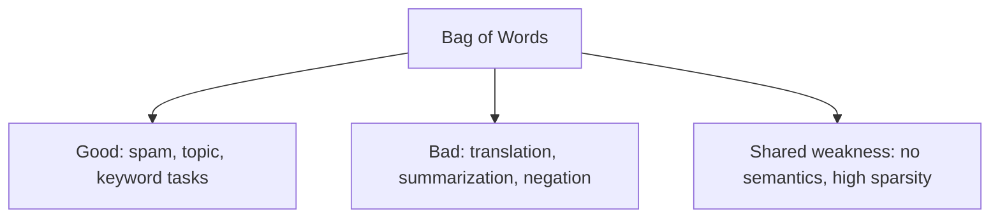

# Advantages and Limitations of Bag of Words

## Intuition: A Workhorse with Blind Spots

Bag of Words is deceptively powerful for keyword-driven tasks and deceptively weak for anything requiring structure or meaning. Knowing both sides prevents over-engineering (using transformers for spam detection) and under-engineering (using BoW for machine translation).

---

## Advantages

| Advantage | Explanation |
|-----------|-------------|
| **Simple to implement** | One `CountVectorizer` call in scikit-learn |
| **Computationally efficient** | No training; linear in corpus size |
| **Surprisingly effective for keyword tasks** | Spam, topic detection, intent routing |
| **Interpretable features** | Each dimension is a word; feature weights are directly explainable |
| **Frequency signal** | Unlike OHE, repeated keywords increase the count |

### Real-World Example: Spam Detection

Spam emails share characteristic vocabulary patterns:

- High counts of: `OTP`, `lottery`, `winner`, `urgent`, `click`, `free`
- Low counts of: normal conversational words

A BoW + logistic regression pipeline on AWS Lambda can score incoming emails in sub-millisecond latency without GPU infrastructure. Grammar is irrelevant — the keywords tell the story.

---

## Limitations

### 1. Complete Loss of Context and Order

These two sentences produce **identical** BoW vectors:

- "The man bit the dog"
- "The dog bit the man"

The meaning is opposite; the representation is the same. Any task where word order determines semantics (negation, question vs statement, subject-verb-object) fails with BoW.

### 2. High Dimensionality and Sparsity

Like OHE, BoW vectors have dimension equal to vocabulary size. A 50,000-word vocabulary means 50,000-dimensional vectors that are ~99% zeros. Memory and compute scale poorly without sparse matrix formats.

### 3. No Semantic Understanding

"Excellent" and "outstanding" are unrelated dimensions. The model must learn their equivalence purely from co-occurrence patterns in labeled data — with no structural hint.

### 4. Vocabulary Growth

Every new unique token (typos, hashtags, product names) expands the matrix. Open-domain text (Twitter, customer reviews) creates unstable, high-dimensional features.

---

## BoW vs TF-IDF vs Dense Embeddings

| Criterion | BoW | TF-IDF | Word2Vec / BERT |
|-----------|-----|--------|-----------------|
| Captures frequency | Yes | Yes (weighted) | N/A |
| Downweights common words | No | Yes | Learned |
| Captures word order | No | No | Partially / Yes |
| Captures semantics | No | No | Yes |
| Training required | No | No | Yes |

---

## Common Pitfalls / Exam Traps

- **"BoW is better than OHE because it counts"** — true for frequency, but both lose order and semantics.
- **Using BoW for sentiment with negation** — "not good" and "good" share the word `good`; BoW cannot distinguish them without n-grams.
- **Exam classic: identical vectors** — always cite "the man bit the dog" vs "the dog bit the man".
- **Assuming BoW fails on all tasks** — it remains competitive for keyword-driven classification at scale.

---

## Quick Revision Summary

- BoW advantages: simple, fast, interpretable, effective for keyword-driven tasks like spam detection.
- BoW limitations: no word order, no semantics, high sparsity, vocabulary explosion.
- "The man bit the dog" and "the dog bit the man" are identical under BoW.
- Frequency counts distinguish BoW from one-hot encoding.
- TF-IDF improves BoW by downweighting common words; dense embeddings address semantics.
- Choose BoW as a baseline; upgrade when order, negation, or meaning matter.
