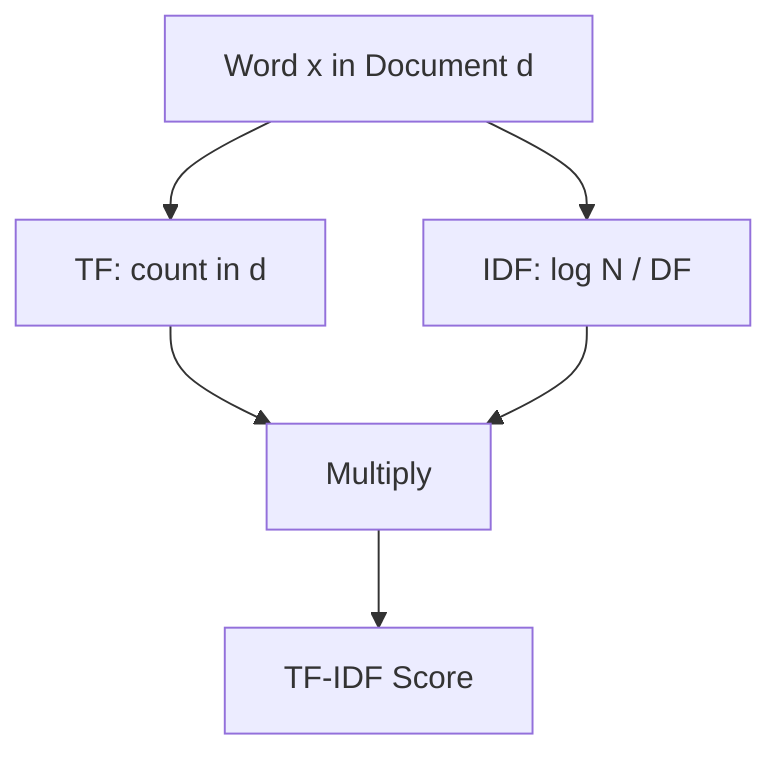

# TF-IDF: Term Frequency–Inverse Document Frequency

## Intuition: Not All Words Are Equal

Bag of Words treats every word equally — `the` and `mitochondria` both contribute to the vector. But common words carry little discriminative power, while rare, domain-specific terms are highly informative.

TF-IDF corrects this imbalance by asking two questions:

1. **How important is this word in this document?** (Term Frequency)
2. **How rare is this word across the entire corpus?** (Inverse Document Frequency)

The result: common words are downweighted; distinctive words are highlighted.

---

## The Two Components

### Term Frequency (TF)

How often word $x$ appears in a single document $d$:

$$\text{TF}(x, d) = \text{count of } x \text{ in } d$$

A word appearing 5 times in a document is more locally important than one appearing once.

### Inverse Document Frequency (IDF)

How rare word $x$ is across all $N$ documents in the corpus:

$$\text{IDF}(x) = \log\frac{N}{\text{DF}(x)}$$

where $\text{DF}(x)$ = number of documents containing word $x$.

- Word in **every** document → $\text{DF} = N$ → $\log(N/N) = \log(1) = 0$ → no weight
- Word in **one** document → $\text{DF} = 1$ → $\log(N/1)$ → maximum weight

---

## Combined Formula

$$\text{TF-IDF}(x, d) = \text{TF}(x, d) \times \log\frac{N}{\text{DF}(x)}$$

The $\log$ dampens the effect so that very rare words do not dominate excessively.

---

## Worked Example

**Corpus:**

| Document |
|----------|
| The car is fast |
| The race car is fast |
| The car is parked |

**Intuition for the word `car`:**
- Appears in all 3 documents → lower IDF than `race` or `parked`
- Appears twice in document 2 → higher TF in that document
- TF-IDF score for `car` varies per document based on local frequency and global rarity

**Intuition for the word `the`:**
- Appears in every document → IDF approaches 0 → heavily downweighted

**Intuition for `mitochondria` in a biology corpus:**
- Appears in few documents → high IDF → strongly weighted when present

---

## TF-IDF vs Bag of Words

| Aspect | BoW | TF-IDF |
|--------|-----|--------|
| Values | Raw integer counts | Float weights |
| Common words | High counts, high weight | Downweighted automatically |
| Rare domain terms | Low counts, low weight | Boosted by high IDF |
| Stopword removal | Often needed manually | Partially automatic |

---

## When TF-IDF Excels

- **Document classification** — news categorization, legal document routing
- **Information retrieval** — search engines rank documents by query term TF-IDF overlap
- **Similarity matching** — cosine similarity on TF-IDF vectors for FAQ deduplication in cloud support systems

---

## Common Pitfalls / Exam Traps

- **Confusing TF and IDF** — TF is per-document frequency; IDF is corpus-wide rarity. Exam questions often swap them.
- **Forgetting the log in IDF** — without log, rare words dominate too aggressively.
- **"TF-IDF eliminates need for stopwords"** — mostly true, but not perfectly; explicit stopword removal can still help.
- **Assuming TF-IDF captures semantics** — it does not. "Car" and "automobile" remain unrelated.

---

## Quick Revision Summary

- TF-IDF = Term Frequency × Inverse Document Frequency.
- TF measures how often a word appears in one document.
- IDF = $\log(N / \text{DF})$ — rare words get higher weight; universal words get near-zero weight.
- Automatically downweights common words like `the`, `is`, `and`.
- Boosts domain-specific rare terms like `mitochondria` in specialized corpora.
- Improves on BoW for classification and retrieval but still lacks semantic understanding.
