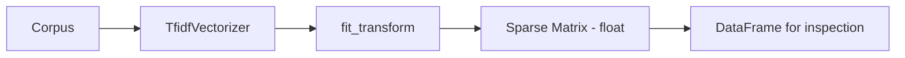

# Implementing TF-IDF in Python

## Intuition: From Formula to Sparse Matrix

Implementing TF-IDF by hand requires computing term counts, document frequencies, and log ratios for every word-document pair. scikit-learn's `TfidfVectorizer` encapsulates this entire pipeline — the same `fit_transform` pattern as `CountVectorizer`, but output values are floats, not integers.

---

## Pipeline Overview



---

## Step 1: Import and Prepare Corpus

```python
from sklearn.feature_extraction.text import TfidfVectorizer
import pandas as pd

corpus = [
    "The car is fast",
    "The race car is fast",
    "The car is parked"
]
```

---

## Step 2: Fit and Transform

```python
tfidf = TfidfVectorizer()
X = tfidf.fit_transform(corpus)
```

**Output:** CSR sparse matrix, `dtype=float`, shape `(3, 6)` — 3 documents, 6 vocabulary terms.

Unlike BoW (integer counts), TF-IDF produces **floating-point weights** reflecting both local frequency and global rarity.

---

## Step 3: Inspect Results

```python
df = pd.DataFrame(
    X.toarray(),
    columns=tfidf.get_feature_names_out(),
    index=corpus
)
```

**Key observation — same word, different scores:**

| Document | `car` score |
|----------|-------------|
| The car is fast | 0.46 |
| The race car is fast | 0.36 |
| The car is parked | 0.41 |

The word `car` receives a **different TF-IDF weight in each document** because:
- Local term frequency differs (`race car` has `car` alongside another distinctive term)
- The relative importance of `car` vs other words in each document differs

Words appearing in all documents (like `the`, `is`) receive lower weights due to low IDF.

---

## TfidfVectorizer vs CountVectorizer

| Property | CountVectorizer | TfidfVectorizer |
|----------|-----------------|-----------------|
| Output type | Integer counts | Float weights |
| Common word handling | No adjustment | Automatic downweighting |
| Underlying steps | Tokenize + count | Tokenize + count + TF-IDF scaling |
| Typical use | BoW baseline | Document classification, retrieval |

Internally, `TfidfVectorizer` applies TF-IDF normalization to the count matrix produced by the same tokenization logic.

---

## Key Parameters

| Parameter | Effect |
|-----------|--------|
| `sublinear_tf` | Use $1 + \log(\text{TF})$ instead of raw TF — dampens high frequencies |
| `smooth_idf` | Adds 1 to DF to avoid division by zero for unseen terms |
| `norm` | `'l2'` (default) — normalizes vectors for cosine similarity |
| `use_idf` | Set `False` to get raw counts (equivalent to BoW) |
| `ngram_range` | Include bigrams/trigrams for partial order capture |

---

## Production Usage

In a document search microservice:

1. `fit` TF-IDF on the indexed document corpus
2. Transform incoming queries with the same vectorizer
3. Compute cosine similarity between query vector and document vectors
4. Return top-$k$ matches

This pattern powers FAQ matching in Azure Bot Service and similar retrieval systems without neural models.

---

## Common Pitfalls / Exam Traps

- **Expecting integer output** — TF-IDF values are floats; BoW values are integers.
- **Fitting on test data** — same leakage risk as BoW; fit only on training corpus.
- **Same word, same score misconception** — TF-IDF scores are per-document; `car` in sentence 1 ≠ `car` in sentence 2.
- **Exam trap: dtype** — if asked what changes from BoW to TF-IDF, answer: integer counts → float weights with IDF scaling.

---

## Quick Revision Summary

- `TfidfVectorizer` from scikit-learn implements TF-IDF via `fit_transform`.
- Output is a float sparse matrix, not integer counts.
- Same word gets different TF-IDF scores in different documents.
- Common words (`the`, `is`) receive low weights; distinctive words receive high weights.
- Fit on training data only; transform new documents with learned vocabulary and IDF.
- Default L2 normalization makes vectors ready for cosine similarity comparisons.
