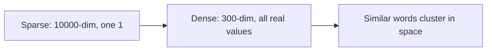

# Dense Word Embeddings: Module Overview

## Intuition: From Symbols to Meaning

Sparse methods (one-hot, BoW, TF-IDF) treat every word as an isolated symbol. The vectors for `car` and `automobile` share no dimensions and have zero similarity — even though humans know they mean nearly the same thing. This **semantic gap** limits every downstream task that depends on word relatedness.

Dense word embeddings solve this by mapping each word into a continuous vector space of 50–300 real numbers, where **geometric proximity reflects semantic similarity**.

---

## The Problem with Sparse Representations

| Issue | Example |
|-------|---------|
| Orthogonality | `dog` and `puppy` have dot product = 0 |
| Dimensionality | 10,000-word vocabulary → 10,000-dim vectors, 99.9% zeros |
| No compositionality | Cannot compute "king − man + woman ≈ queen" |

In a cloud search system, sparse methods cannot match a query for "automobile insurance" to documents about "car coverage" without exact keyword overlap.

---

## The Dense Embedding Solution

Instead of a vector of 10,000 zeros and one 1, represent each word as:

$$\mathbf{v}_{\text{king}} = [0.2,\ -0.5,\ 0.8,\ \ldots] \in \mathbb{R}^{d}$$

where $d$ is typically 50–300.

**Core insight (distributional hypothesis):** words that appear in similar contexts will have similar vectors.

---

## The Famous Analogy: Vector Arithmetic

Word embeddings capture relational structure through vector arithmetic:

$$\mathbf{v}_{\text{king}} - \mathbf{v}_{\text{man}} + \mathbf{v}_{\text{woman}} \approx \mathbf{v}_{\text{queen}}$$

Intuition: subtract "maleness" from "king", add "femaleness" → arrive near "queen".

Similarly: $\mathbf{v}_{\text{Paris}} - \mathbf{v}_{\text{France}} + \mathbf{v}_{\text{Germany}} \approx \mathbf{v}_{\text{Berlin}}$

This works because embeddings encode latent attributes (gender, royalty, geography) as directions in vector space.

---

## Techniques in This Module

| Method | Approach | Key Idea |
|--------|----------|----------|
| **Word2Vec** | Shallow neural network | Predict context from word (or vice versa) |
| **GloVe** | Matrix factorization | Global co-occurrence statistics |
| **Visualization** | PCA / t-SNE | Project high-dim vectors to 2D |
| **Static vs Contextual** | Comparison | One vector per word vs context-dependent |

---

## Module Transition

| Previous Module | This Module |
|----------------|-------------|
| Frequency counting | Semantic understanding |
| Sparse, high-dimensional | Dense, low-dimensional |
| Words as atomic symbols | Words as points in continuous space |
| No similarity between synonyms | Cosine similarity reflects meaning |

---

## Common Pitfalls / Exam Traps

- **Confusing "embedding" with only dense vectors** — TF-IDF is also called a word embedding in the broad sense.
- **Assuming all embeddings are contextual** — Word2Vec and GloVe produce one fixed vector per word (static).
- **"Dense = better always"** — TF-IDF can outperform Word2Vec on small datasets or keyword tasks.
- **Exam trap: dimensionality** — dense embeddings use 50–300 dims; sparse use vocabulary size.

---

## Quick Revision Summary

- Dense embeddings map words to low-dimensional continuous vectors (50–300 dims).
- Similar contexts → similar vectors (distributional hypothesis).
- Solves the semantic gap: `car` ≈ `automobile` in vector space.
- Vector arithmetic captures relationships: king − man + woman ≈ queen.
- Word2Vec (neural) and GloVe (co-occurrence matrix) are the two main static methods.
- This module transitions from frequency counting to semantic representation.
