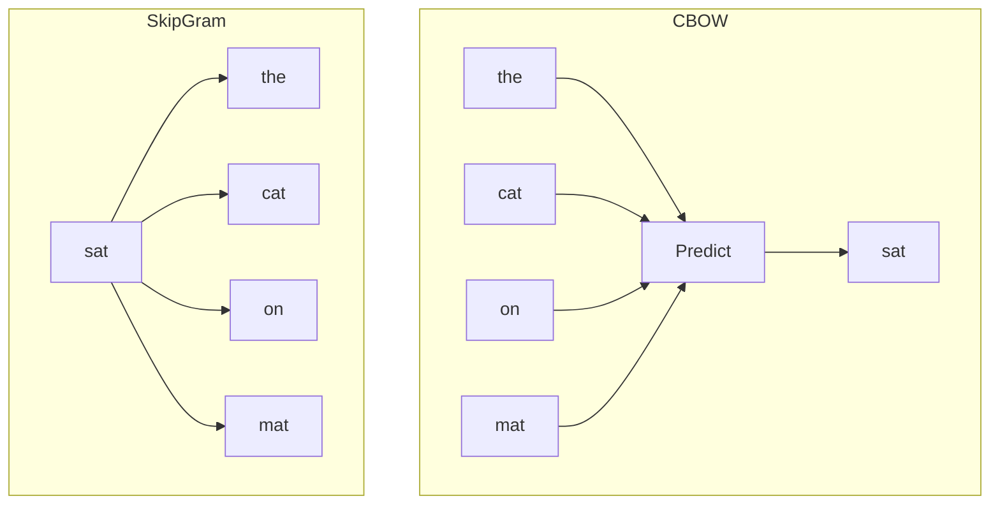

# Word2Vec: Learning Word Embeddings

## Intuition: Predict to Compress

Word2Vec learns word meanings by training a shallow neural network on a simple task: **predict a missing word from its neighbors** (or predict neighbors from a word). To solve this prediction efficiently, the network compresses word meanings into dense vectors in its hidden layer. These hidden-layer weights become the embeddings.

The training objective forces words in similar contexts to develop similar representations.

---

## Architecture Overview

Word2Vec is not a single architecture — it comes in two flavors:

| Architecture | Input | Output | Task |
|-------------|-------|--------|------|
| **CBOW** (Continuous Bag of Words) | Context words | Target word | Fill in the blank |
| **Skip-gram** | Target word | Context words | Predict surroundings |

Both are shallow neural networks (one hidden layer) trained on large corpora.

---

## CBOW: Context → Target

**Continuous Bag of Words** averages context word vectors and predicts the center word.

**Example sentence:** "The cat sat on the mat"

**Training instance:**
- Input (context): `the`, `cat`, `on`, `mat`
- Output (target): `sat`

Like a fill-in-the-blanks game: given surrounding words, predict the missing center word.

CBOW is **faster** to train because it predicts one word from many context inputs averaged together.

---

## Skip-gram: Target → Context

**Skip-gram** takes the center word and predicts each surrounding context word.

**Training instance:**
- Input (target): `sat`
- Output (context): `the`, `cat`, `on`, `mat`

Skip-gram is **slower** but often performs better on rare words because it generates more training examples per word.

---

## How Embeddings Emerge

During training:

1. Each word is initially assigned a random vector
2. The network adjusts vectors to minimize prediction error
3. Words that share contexts (e.g., `cat` and `dog` both follow `the`) move closer in vector space
4. After training, the hidden-layer weight matrix rows are the word embeddings

$$\mathbf{v}_w \in \mathbb{R}^{d}, \quad d \in [50, 300]$$

---

## CBOW vs Skip-gram

| Criterion | CBOW | Skip-gram |
|-----------|------|-----------|
| Direction | Context → target | Target → context |
| Speed | Faster | Slower |
| Rare words | Less effective | Better |
| Training examples per word | Fewer | More |
| Best for | Large, clean corpora | Smaller corpora, rare terms |

---

## Real-World Usage

Pretrained Word2Vec models power:
- Semantic similarity in recommendation systems (similar product descriptions)
- Feature initialization for downstream NLP models
- Vocabulary expansion in search (find related terms)

In Gensim, pretrained models like `word2vec-google-news-300` provide 3 million words in 300 dimensions — ready for cosine similarity queries without training from scratch.

---

## Common Pitfalls / Exam Traps

- **Confusing CBOW and Skip-gram direction** — CBOW: many → one; Skip-gram: one → many.
- **"Word2Vec is a deep network"** — it is a shallow (single hidden layer) network.
- **Assuming Word2Vec is contextual** — each word gets one fixed vector regardless of sentence context.
- **Exam trap: training objective** — Word2Vec learns by prediction, not by counting co-occurrences (that's GloVe).

---

## Quick Revision Summary

- Word2Vec learns dense embeddings via a shallow neural network trained on word prediction.
- CBOW: context words → predict target word (fill in the blank).
- Skip-gram: target word → predict context words (opposite direction).
- Similar contexts produce similar vectors (distributional hypothesis).
- CBOW is faster; Skip-gram handles rare words better.
- Embeddings live in the hidden layer weights; typical dimension: 50–300.
