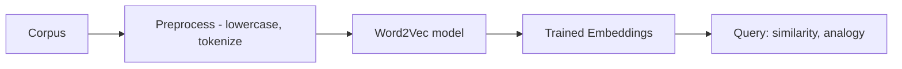

# Implementing Word2Vec with Gensim

## Intuition: Training Embeddings on Your Own Corpus

Conceptual understanding of CBOW and Skip-gram is necessary; training a model on a real corpus reveals how hyperparameters control context window, dimensionality, and vocabulary filtering. Gensim provides a production-ready `Word2Vec` implementation.

---

## Pipeline Overview



---

## Step 1: Install and Import

```python
# pip install gensim
from gensim.models import Word2Vec
```

---

## Step 2: Prepare Corpus

```python
corpus = [
    "I love machine learning",
    "Machine learning is fascinating",
    "I love dogs",
    # ... more sentences
]

# Preprocess: lowercase + tokenize
tokenized_corpus = [sentence.lower().split() for sentence in corpus]
```

Gensim expects a **list of lists** — each inner list is a tokenized sentence.

---

## Step 3: Train the Model

```python
model = Word2Vec(
    sentences=tokenized_corpus,
    vector_size=50,
    window=3,
    min_count=1,
    workers=4
)
```

### Hyperparameters

| Parameter | Value | Meaning |
|-----------|-------|---------|
| `sentences` | tokenized corpus | Training data |
| `vector_size` | 50 | Embedding dimensionality ($d$) |
| `window` | 3 | Context window: 3 words before and after the target |
| `min_count` | 1 | Ignore words appearing fewer than this many times |
| `workers` | 4 | Number of CPU threads for parallel training |

**Window example:** for the word `learning` in "I am learning machine learning love":
- Window = 3 looks at 3 words before and 3 words after
- Context includes: `am`, `machine`, `love`, etc.

---

## Step 4: Query Embeddings

### Get a word vector

```python
model.wv['machine']
# array([0.02, -0.15, 0.33, ...])  — 50-dimensional
```

### Find similar words

```python
model.wv.most_similar('machine', topn=3)
# [('learning', 0.85), ('dog', 0.42), ('love', 0.38)]
```

Similarity quality depends on:
- **Corpus size** — small corpora produce noisy similarities
- **Hyperparameters** — window size, vector dimension, min_count
- **Domain relevance** — a general corpus won't capture specialized terminology

On a small demo corpus, `machine` may be similar to `learning` (co-occurrence) but also spuriously to unrelated words — this is expected with insufficient data.

---

## Production Considerations

| Approach | When |
|----------|------|
| Train from scratch | Domain-specific corpus (medical, legal, internal docs) |
| Load pretrained | General English (Google News 300, fastText) |
| Fine-tune | Start pretrained, continue training on domain data |

For cloud deployments, pretrained embeddings reduce training cost; custom training is justified when domain vocabulary diverges significantly from general English.

---

## Common Pitfalls / Exam Traps

- **Not lowercasing** — `Machine` and `machine` become separate vocabulary entries.
- **Passing raw strings instead of tokenized lists** — Gensim requires `List[List[str]]`.
- **`min_count` too high on small corpora** — rare but important words get dropped.
- **Overinterpreting similarities from tiny corpora** — exam/demo models are not production quality.
- **Exam trap: `vector_size`** — this is embedding dimensionality, not context window.

---

## Quick Revision Summary

- Gensim `Word2Vec` trains embeddings from a tokenized corpus (list of lists).
- Key hyperparameters: `vector_size` (dims), `window` (context radius), `min_count`, `workers`.
- `model.wv['word']` returns the embedding vector; `most_similar()` finds nearest neighbors.
- Preprocess with lowercase and whitespace tokenization before training.
- Similarity quality scales with corpus size and domain coherence.
- Pretrained models are preferred for general English; train custom for specialized domains.
