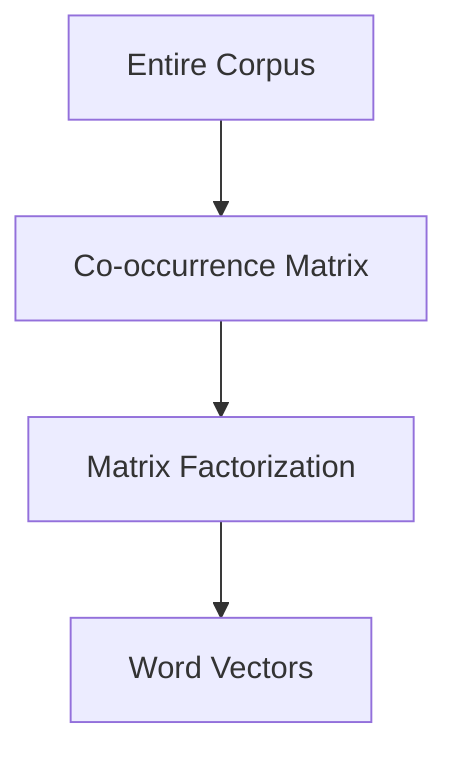

# GloVe: Global Vectors for Word Representation

## Intuition: Global Statistics, Not Local Windows

Word2Vec learns from local context windows — it sees a few neighboring words at a time. **GloVe** (Global Vectors) takes a different approach: build a **global co-occurrence matrix** counting how often every word pair appears together across the entire corpus, then factorize this matrix to produce word vectors.

GloVe combines the strengths of count-based methods (global statistics) and prediction-based methods (dense vectors).

---

## How GloVe Differs from Word2Vec

| Aspect | Word2Vec | GloVe |
|--------|----------|-------|
| Training signal | Local context windows | Global co-occurrence matrix |
| Architecture | Shallow neural network | Matrix factorization |
| Scope | Neighborhood around each word | Entire corpus statistics |
| Pretrained availability | Google News, etc. | Wikipedia, Twitter, Common Crawl |

---

## The Co-occurrence Matrix

For vocabulary of size $|V|$, construct a $|V| \times |V|$ matrix $X$ where:

$$X_{ij} = \text{number of times word } j \text{ appears in the context of word } i$$

This matrix captures **global** word-word relationships — not just immediate neighbors.

Matrix factorization decomposes $X$ into lower-dimensional word vectors $\mathbf{w}_i$ and $\mathbf{w}_j$ such that:

$$\mathbf{w}_i^T \mathbf{w}_j \approx \log X_{ij}$$

---

## The Ratio Intuition

GloVe's key insight: the **ratio of co-occurrence probabilities** encodes meaning.

Consider words `ice`, `steam`, and probe words `solid`, `gas`, `water`:

| Probe word | P(word \| ice) | P(word \| steam) | Ratio |
|------------|----------------|-------------------|-------|
| solid | High | Very low | Large |
| gas | Very low | High | Small |
| water | High | High | ≈ 1 |

The ratio $P(\text{solid} \mid \text{ice}) / P(\text{solid} \mid \text{steam})$ is large — revealing that `ice` relates to `solid`. Similarly, ratios near 1 indicate words common to both (`water`), and small ratios reveal `steam` → `gas` associations.

This ratio-based encoding captures abstract concepts (states of matter, thermodynamics) from raw co-occurrence statistics.

---

## GloVe vs Word2Vec in Practice

| Criterion | GloVe | Word2Vec |
|-----------|-------|----------|
| Training data efficiency | Uses global counts (efficient) | Requires many window passes |
| Rare words | Good (global counts help) | Skip-gram better for rare words |
| Pretrained models | Widely available (Gensim, spaCy) | Widely available |
| Vector arithmetic | Strong (king − man + woman) | Strong |
| Training from scratch | Slower (matrix construction) | Faster with Gensim |

---

## Common Pretrained Models

| Model | Dimensions | Corpus |
|-------|-----------|--------|
| `glove-wiki-gigaword-100` | 100 | Wikipedia + Gigaword |
| `glove-twitter-25` | 25 | Twitter data |
| `glove-840B-300d` | 300 | Common Crawl (840B tokens) |

Pretrained GloVe models are ideal for quick prototyping — download and query without training.

---

## Common Pitfalls / Exam Traps

- **"GloVe is a neural network"** — it uses matrix factorization, not backpropagation through a prediction task.
- **Confusing local vs global** — Word2Vec = local windows; GloVe = global co-occurrence.
- **Assuming GloVe is contextual** — like Word2Vec, one fixed vector per word.
- **Exam trap: what GloVe adds over Word2Vec** — global co-occurrence statistics via matrix factorization.

---

## Quick Revision Summary

- GloVe = Global Vectors for Word Representation.
- Builds a global word co-occurrence matrix, then factorizes it into dense vectors.
- Ratio of co-occurrence probabilities encodes semantic relationships.
- Combines count-based global statistics with dense vector output.
- Pretrained models available (Wikipedia, Twitter, Common Crawl).
- Static embeddings — one vector per word, no context sensitivity.
