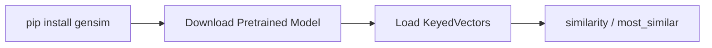

# Implementing GloVe with Gensim

## Intuition: Pretrained Embeddings Ready to Use

Training GloVe from scratch requires building a co-occurrence matrix over a large corpus — computationally expensive. Gensim provides pretrained GloVe models via its downloader API, enabling immediate similarity and analogy queries without training.

---

## Pipeline Overview



---

## Step 1: Install and Download

```python
# pip install gensim
import gensim.downloader as api

# Download pretrained model (one-time)
glove_model = api.load("glove-twitter-25")
```

### Available Models

| Model Name | Dimensions | Training Data |
|------------|-----------|---------------|
| `glove-twitter-25` | 25 | Twitter |
| `glove-twitter-100` | 100 | Twitter |
| `glove-wiki-gigaword-50` | 50 | Wikipedia + Gigaword |
| `glove-wiki-gigaword-100` | 100 | Wikipedia + Gigaword |
| `glove-840B-300d` | 300 | Common Crawl (840B tokens) |

For production semantic search, `glove-wiki-gigaword-100` or `glove-840B-300d` offer better quality than the small Twitter model.

---

## Step 2: Word Similarity

```python
glove_model.similarity("king", "queen")
# ~0.92 — high similarity (royalty, gender-related concepts)
```

```python
glove_model.similarity("king", "car")
# ~0.67 — lower similarity (unrelated domains)
```

Cosine similarity ranges from −1 to 1; values near 1 indicate strong semantic relatedness.

---

## Step 3: Word Analogies

Gensim supports analogy queries via `most_similar`:

```python
glove_model.most_similar(
    positive=["woman", "king"],
    negative=["man"],
    topn=1
)
# [('queen', 0.85)]
```

This implements the vector arithmetic:

$$\mathbf{v}_{\text{king}} - \mathbf{v}_{\text{man}} + \mathbf{v}_{\text{woman}} \approx \mathbf{v}_{\text{queen}}$$

**How it works:**
- `positive` words are **added** to the query vector
- `negative` words are **subtracted**
- The model returns words whose vectors are closest to the resulting vector

### Another Example

```python
glove_model.most_similar(
    positive=["woman", "man"],
    negative=["king"],
    topn=1
)
# Returns a word in the direction of "commoner" or similar
```

---

## GloVe vs Training Word2Vec

| Approach | Code | Training Time | Quality |
|----------|------|---------------|---------|
| Pretrained GloVe | `api.load("glove-wiki-gigaword-100")` | None (download only) | High for general English |
| Train Word2Vec | `Word2Vec(sentences=...)` | Minutes to hours | Depends on corpus |
| Train GloVe from scratch | External tools (Stanford GloVe) | Hours to days | Depends on corpus |

For most cloud ML prototypes, pretrained GloVe is the fastest path to semantic features.

---

## Common Pitfalls / Exam Traps

- **Using a tiny model for serious tasks** — `glove-twitter-25` (25 dims) is for demos; production needs 100–300 dims.
- **Words not in vocabulary** — `KeyError` if the word was not in training data; handle with try/except or `model.key_to_index` check.
- **Confusing `positive`/`negative` order** — order within lists does not matter; addition/subtraction direction does.
- **Exam trap: GloVe in Gensim is pretrained only** — Gensim loads pretrained GloVe; training GloVe requires Stanford's original implementation.

---

## Quick Revision Summary

- Gensim `api.load()` downloads and loads pretrained GloVe models.
- `similarity(w1, w2)` returns cosine similarity between two word vectors.
- `most_similar(positive=[...], negative=[...])` solves analogy tasks via vector arithmetic.
- king − man + woman ≈ queen is the canonical analogy example.
- Pretrained models avoid training cost; choose dimensionality based on task requirements.
- Handle out-of-vocabulary words explicitly in production code.
